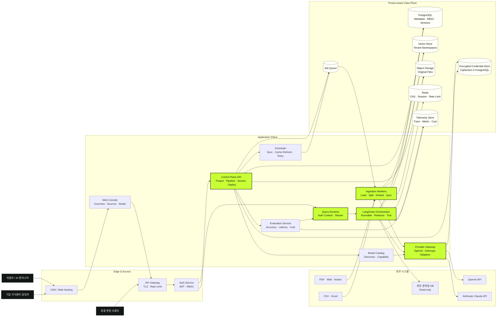
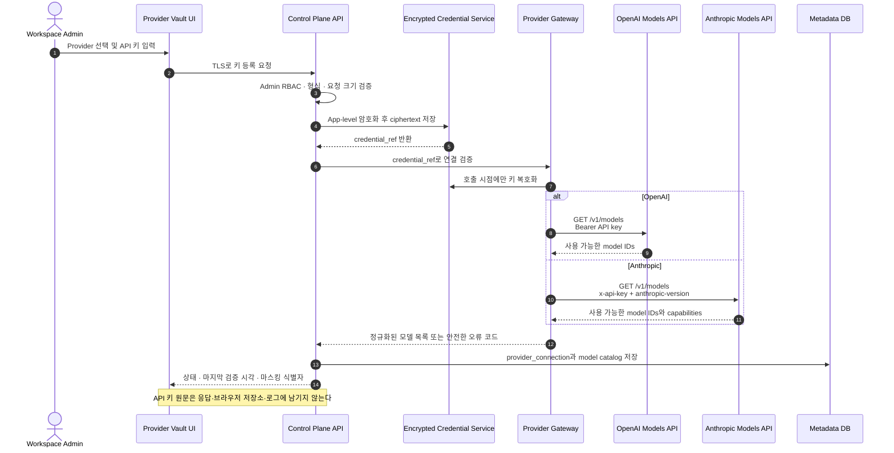
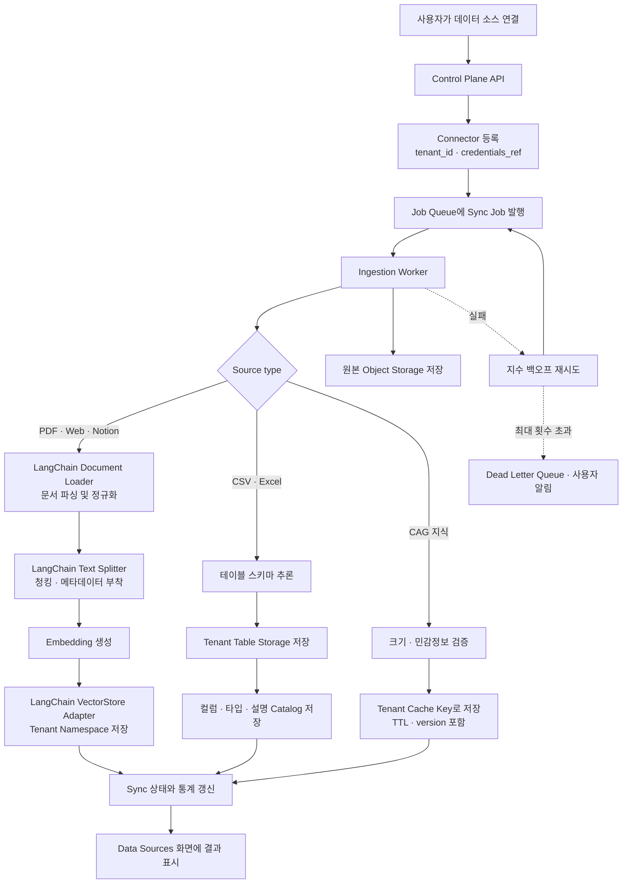
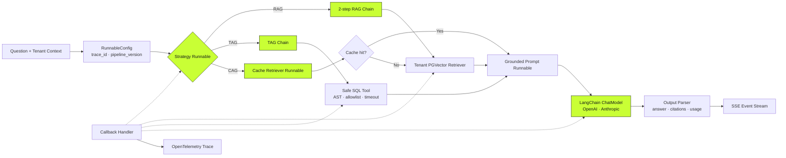
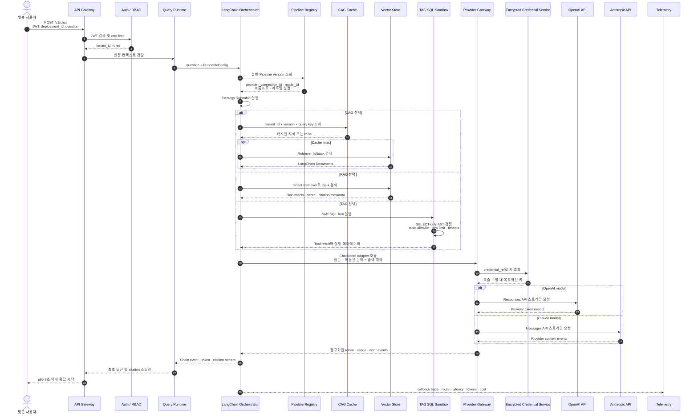
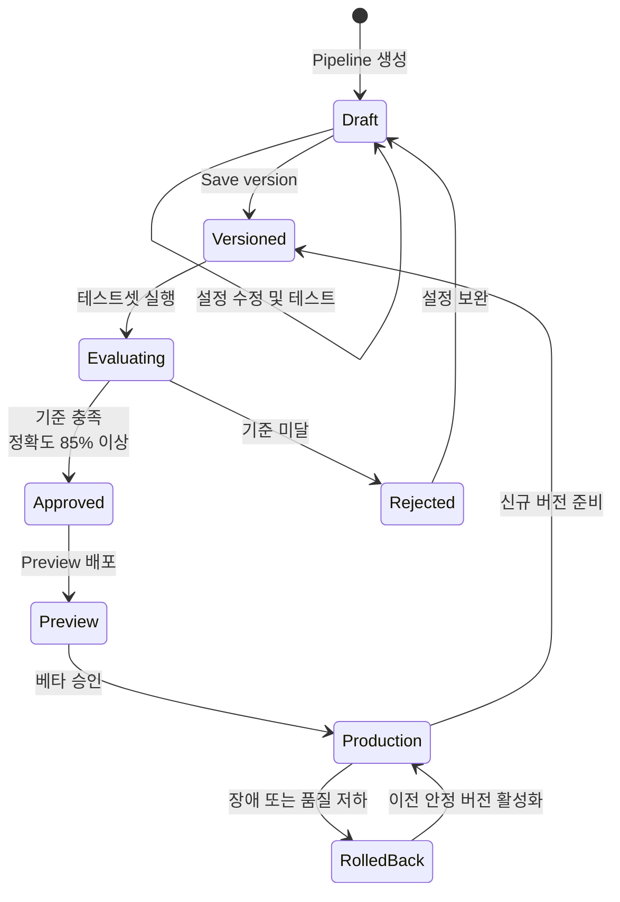
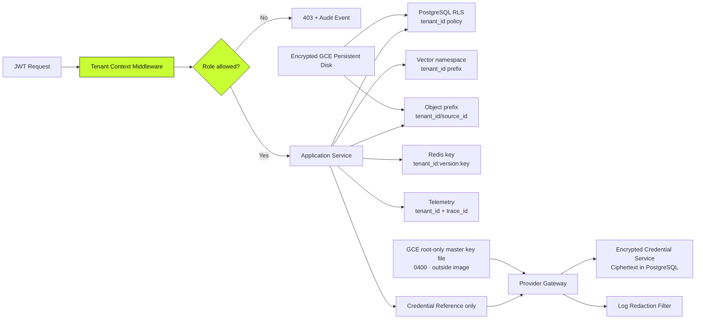
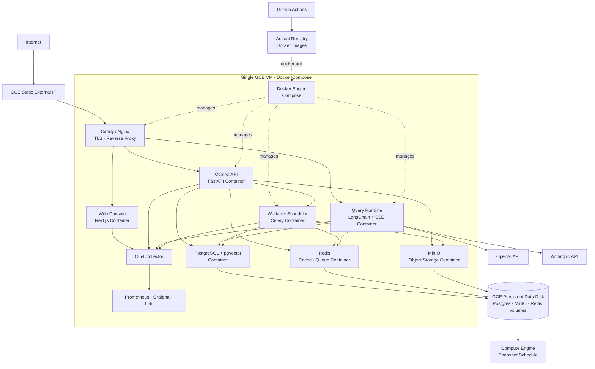

# LLMOps 기반 개인화 AI 챗봇 플랫폼 아키텍처 v1.3

> 기준 문서: [PRD.md](./PRD.md)  
> 대상: LangChain 학습용 단일 GCE 배포, 1,000 DAU, 동시 요청 50건, 최초 응답 p95 3초 이내

## 1. 설계 원칙

1. **테넌트 격리 우선**: 모든 요청과 저장 데이터는 `tenant_id` 경계를 강제한다.
2. **실시간 경로 최소화**: 질의 처리 경로에서는 동기화·임베딩 등 무거운 작업을 수행하지 않는다.
3. **독립 확장**: API, Query Runtime, 비동기 Worker를 각각 수평 확장한다.
4. **안전한 TAG**: 생성 SQL은 검증 후 읽기 전용 세션에서만 실행한다.
5. **버전 불변성**: 배포는 변경 가능한 Draft가 아닌 불변 Pipeline Version을 참조한다.
6. **관측 가능한 AI**: 라우팅, 검색 결과, 토큰, 비용, 지연시간과 출처를 실행 단위로 기록한다.
7. **Provider 비종속성**: OpenAI와 Anthropic의 요청·스트림·사용량·오류 차이는 Adapter 경계에서 정규화한다.
8. **LangChain 학습 가능성**: Runnable·Retriever·Tool·callback의 경계와 실행 결과를 코드와 trace에서 확인할 수 있어야 한다.
9. **최소 GCP 범위**: Artifact Registry와 Compute Engine만 사용하고 애플리케이션·데이터 서비스는 Docker Compose로 자체 운영한다.

## 2. 시스템 컨텍스트 및 컨테이너 아키텍처

### 실행 단위

| 실행 단위 | 책임 | 확장 기준 |
|---|---|---|
| Web Console | 목업의 Overview, Sources, Providers, Pipeline Studio, Playground, Deployments 제공 | 정적 CDN 캐싱 |
| Control Plane API | 프로젝트, 커넥터, Provider 연결, 파이프라인 설정, 버전, 배포 관리 | API 요청량 |
| Query Runtime | 인증된 질의를 RAG·TAG·CAG로 처리하고 스트리밍 응답 | 동시 질의 수, LLM 대기시간 |
| LangChain Orchestrator | Runnable, Retriever, Tool을 조합하고 callback trace 생성 | Chain 실행 수와 단계별 지연시간 |
| Provider Gateway | 키 조회, OpenAI·Anthropic Adapter 호출, 응답·비용·오류 정규화 | Provider별 요청량과 rate limit |
| Ingestion Worker | 파싱·청킹·임베딩·동기화 작업 실행 | Queue backlog, 처리 데이터량 |
| Evaluation Service | 테스트셋 실행 및 정확도·지연시간·비용 계산 | 평가 작업 수 |

MVP에서는 Control Plane API를 **모듈러 모놀리스**로 유지한다. Web, API, Query Runtime, Worker와 데이터 서비스는 단일 GCE VM에서 별도 Docker Compose 컨테이너로 실행한다. LangChain은 Query Runtime의 Application 계층에 위치하며 도메인 모델이나 저장소 인터페이스가 LangChain 타입에 직접 의존하지 않게 한다.

### Provider Credential 등록 및 모델 동기화

Provider 연결 메타데이터에는 `tenant_id`, `provider`, `credential_ref`, `masked_hint`, `status`, `last_validated_at`만 저장한다. 암호화 master key는 GCE의 root 전용 파일에 보관하며 저장소나 컨테이너 이미지에 포함하지 않는다. 키 교체는 새 ciphertext version을 활성화하고 이전 버전은 짧은 rollback window 이후 폐기한다.

## 3. 데이터 수집 및 인덱싱 흐름

### 수집 데이터 계약

모든 인덱스 레코드는 최소한 다음 필드를 가진다.

| 필드 | 목적 |
|---|---|
| `tenant_id` | 테넌트 격리와 접근 제어 |
| `source_id` | 원본 데이터 소스 추적 |
| `document_id` 또는 `table_id` | 출처 표시 및 삭제 전파 |
| `pipeline_version` | 재현 가능한 평가와 롤백 |
| `content_hash` | 중복 처리 방지 |
| `classification` | 민감도와 보존 정책 적용 |
| `created_at`, `updated_at` | 동기화 상태 판단 |

## 4. RAG · TAG · CAG 질의 처리

### LangChain 내부 구성

MVP는 호출 횟수와 지연시간이 예측 가능한 **2-step RAG**로 구현한다. Agentic RAG와 LangGraph는 기본 경로를 대체하지 않고 별도 학습 브랜치에서 비교 실험한다.

### 라우팅 정책

1. MVP 기본값은 사용자가 Pipeline Studio에서 선택한 **수동 전략**이다.
2. 자동 라우팅은 Should 기능이며, 활성화되더라도 낮은 confidence에서는 설정된 fallback 전략을 사용한다.
3. CAG cache miss는 오류가 아니며 제한된 RAG fallback을 허용한다.
4. TAG는 원본 DB에 쓰기 권한을 갖지 않으며 `SELECT` 외 문장을 거부한다.
5. 출처 메타데이터가 없는 RAG·TAG 답변은 UI에서 검증되지 않은 답변으로 표시한다.
6. Provider Gateway는 모델 capability에 따라 지원되지 않는 파라미터를 요청 전에 거부한다.
7. Provider fallback은 키가 연결되어 있고 관리자가 명시적으로 허용한 모델에만 수행한다.

## 5. 파이프라인 버전 관리 및 배포

### 버전 불변 데이터

- Provider ID, Provider Connection ID, 모델 ID 및 모델 파라미터
- LangChain Chain type, Runnable 설정과 prompt template version
- 시스템 프롬프트
- RAG `top_k`, 유사도 임계값, reranker 설정
- TAG 허용 테이블과 SQL 안전 정책
- CAG cache version과 TTL 정책
- 라우팅 전략 및 fallback
- 연결된 데이터 소스 snapshot 참조

Pipeline Version에는 API 키나 secret version을 저장하지 않는다. 키 회전은 동일한 `provider_connection_id` 아래에서 수행하므로 파이프라인 버전을 새로 만들지 않고도 안전하게 적용된다.

배포 레코드는 `deployment_id → pipeline_version_id` 포인터만 변경한다. 롤백 시 데이터 복사 없이 이전 버전 포인터를 원자적으로 재활성화한다.

## 6. 멀티테넌시 및 보안 경계

| 보안 통제 | 구현 기준 |
|---|---|
| 인증 | 짧은 수명의 JWT Access Token과 회전 가능한 Refresh Token |
| 권한 | Workspace Admin, Developer, Viewer 역할 기반 RBAC |
| DB 격리 | 애플리케이션 필터만 신뢰하지 않고 PostgreSQL RLS 적용 |
| 비밀정보 | OpenAI·Anthropic·Notion·DB 자격증명은 app-level 암호화 ciphertext만 PostgreSQL에 저장 |
| Provider 키 접근 | Workspace Admin만 등록·교체·삭제 가능하며 등록 후 원문 재조회 불가 |
| Provider 호출 | 브라우저 직접 호출 금지, Provider Gateway에서 호출 시점에만 복호화 |
| 키 노출 방지 | 요청·응답·trace·오류·분석 로그에 키 패턴 탐지와 마스킹 적용 |
| Master key | GCE root 전용 파일로 컨테이너에 read-only mount하고 별도 암호화 백업·회전 runbook 운영 |
| 키 수명주기 | 연결 검증, ciphertext version 교체, 비활성화, 삭제, 감사 이벤트를 지원 |
| TAG 보호 | 읽기 전용 계정, SQL AST 검사, allowlist, 행 제한, timeout |
| 암호화 | 외부 TLS, 저장 데이터 암호화, 로그 내 비밀정보 마스킹 |
| 삭제 | 원본·벡터·테이블·캐시·로그로 삭제 이벤트 전파 |

## 7. 배포 토폴로지

GCE 방화벽은 외부에서 80/443만 허용하고 관리 SSH는 허용된 관리자 범위와 OS Login으로 제한한다. PostgreSQL, Redis, MinIO, 관측성 포트는 Docker 내부 network에만 노출한다. GCE Service Account에는 Artifact Registry Reader 최소 권한만 부여해 VM이 이미지를 pull하게 한다.

### 확장 및 장애 대응

| 대상 | 확장 신호 | 대응 |
|---|---|---|
| GCE VM | CPU, memory, disk, container restart | machine type 또는 Persistent Disk 확장, container resource limit 조정 |
| Query Runtime | 동시 요청, p95 최초 토큰 시간 | Uvicorn worker 조정, Provider timeout, 필요 시 별도 GCE 분리 |
| Celery Worker | queue length, oldest task, failed task | worker concurrency 조정, 실패 작업 PostgreSQL 기록 |
| PostgreSQL | CPU, connection, slow query | connection pool, 인덱스·vacuum 조정, 필요 시 별도 GCE 분리 |
| pgvector | 검색 p95, index 크기, recall | tenant filter, HNSW tuning, 필요 시 관리형 DB/전용 Vector DB 검토 |
| Redis | hit rate, memory, eviction | TTL·tenant quota, maxmemory policy 조정 |
| Provider Gateway | Provider별 오류율, rate limit | Provider별 격리 pool, 재시도 budget, circuit breaker |
| OpenAI·Anthropic | 외부 API 오류율, 최초 토큰 시간 | 승인된 대체 모델, timeout, 명시적 장애 상태 표시 |

### 단일 VM 제약

- VM 장애나 재부팅 시 전체 서비스가 중단되는 단일 장애점이 존재한다.
- 무중단 배포와 자동 수평 확장은 제공하지 않는다.
- Persistent Disk snapshot은 crash-consistent일 수 있으므로 PostgreSQL `pg_dump`와 복구 테스트를 병행한다.
- 운영 서비스로 확장할 때는 DB·Redis·object storage를 먼저 분리한 뒤 다중 GCE 또는 관리형 서비스 전환을 검토한다.

## 8. 관측성과 SLO

모든 요청은 Gateway에서 생성한 `trace_id`와 인증 계층에서 결정한 `tenant_id`를 가진다.

| 지표 | 목표 / 경보 기준 |
|---|---|
| 최초 응답 시간 | p95 ≤ 3초 |
| 월간 가용성 | ≥ 99.0% |
| 답변 정확도 | 평가 테스트셋 기준 ≥ 85% |
| 평균 AI 직접 비용 | 질의당 ≤ $0.03 |
| Query Runtime 오류율 | 5분 평균 2% 초과 시 경보 |
| Queue 지연 | 가장 오래된 작업 5분 초과 시 경보 |
| 데이터 격리 | 교차 테넌트 접근 테스트 실패 0건 |
| Provider 연결 검증 | 성공·실패율, 마지막 검증 시각, 오류 유형 추적 |
| 비밀정보 노출 | 로그 및 API 응답 secret scanner 검출 0건 |

필수 trace span은 `gateway`, `auth`, `langchain.chain`, `langchain.retriever`, `langchain.tool`, `provider_resolve`, `provider_call`, `llm_first_token`, `stream_complete`이다. LangChain callback을 OpenTelemetry span으로 변환한다. 프롬프트·원문·API 키는 기본 로그에서 제외하고 Provider ID, 모델 ID, 식별자·해시·사용량만 기록한다.

## 9. 요구사항 추적성

| PRD 요구사항 | 아키텍처 컴포넌트 |
|---|---|
| FR-01~02 데이터 수집·처리 | Control Plane, Queue, Ingestion Worker, Object Storage |
| FR-03 RAG | Query Runtime, Vector Store, Embedding Provider |
| FR-04 TAG | Query Runtime, Table Catalog, SQL Sandbox |
| FR-05 CAG | Query Runtime, Redis, Scheduler |
| FR-06~07 전략·실행 설정 | Pipeline Registry, Control Plane |
| FR-08 배포 | API Gateway, Deployment Registry, Web Console |
| FR-09 버전·롤백 | Immutable Pipeline Version, atomic deployment pointer |
| FR-10 Provider 연결 | Provider Vault UI, Control Plane, Encrypted Credential Service |
| FR-11~12 모델 탐색·실행 | Model Catalog, Provider Gateway, LangChain ChatModel Adapters |
| FR-13~15 LangChain 학습 | Runnable, Retriever, Tool, callback trace, tests, ADR |
| FR-16~20 | DB Connector, Router, Evaluation Service, Telemetry, Circuit Breaker |
| NFR-02~06 보안·격리 | JWT, RBAC, RLS, tenant namespace, Docker private network |
| NFR-07~10 성능·확장 | Query Runtime 분리, cache, queue, horizontal scaling |
| NFR-11~12 관측·복구 | Telemetry, trace_id, immutable versions, rollback |
| NFR-13~17 키 보안·격리 | App-level encryption, GCE root-only master key, Admin RBAC, redaction, audit |
| NFR-18~21 배포·IaC·경계 | Artifact Registry, GCE Docker Compose, Persistent Disk, Terraform, LangChain Adapter boundary |

## 10. MVP 권장 기술 구성

LangChain 학습과 GCP 배포를 전제로 한 확정 구성이다.

| 영역 | 권장 선택 | 이유 |
|---|---|---|
| Web Console | TypeScript, Next.js App Router, React | 목업의 다중 작업 화면과 SSE 스트리밍 UI 구현 |
| API / Runtime | Python, FastAPI, Pydantic, SQLAlchemy | LangChain 생태계와 비동기 스트리밍 지원 |
| LLM Orchestration | `langchain`, `langchain-core` | Runnable·Retriever·Tool·callback 학습과 조합 |
| Provider Integration | `langchain-openai`, `langchain-anthropic` | 동일한 ChatModel 인터페이스로 모델 교체 |
| RAG | LangChain Loader·Text Splitter·PGVector Retriever | Load → Split → Embed → Retrieve → Generate 전 과정 학습 |
| TAG | LangChain Tool + 격리된 DuckDB worker | Tool 호출을 학습하면서 SQL 안전 경계 유지 |
| CAG | LangChain custom Retriever/Runnable + Redis | Cache hit/miss와 RAG fallback을 명시적으로 구성 |
| GCP Runtime | Compute Engine + Docker Engine + Docker Compose | 단일 VM에서 전체 학습 스택을 명시적으로 운영 |
| Credential Store | App-level encryption + root-only master key file | 추가 GCP 서비스 없이 API 키 비노출과 교체 지원 |
| Metadata / Vector | PostgreSQL + pgvector container | 트랜잭션·RLS·벡터 검색을 하나의 DB로 시작 |
| Cache / Queue | Redis + Celery containers | CAG, session, rate limit, 비동기 작업 |
| Object Storage | MinIO container | 원본 파일과 평가 산출물의 S3 호환 저장 |
| Reverse Proxy | Caddy 또는 Nginx container | TLS 종료, Web·API·SSE routing |
| Container / CI | Artifact Registry + GitHub Actions | 이미지를 저장하고 GCE에서 digest로 pull |
| Persistent Data | GCE Persistent Disk + snapshot schedule | 컨테이너 상태 분리와 정기 백업 |
| IaC | Terraform Google Provider | Artifact Registry, GCE, disk, firewall, IAM 재현 |
| Observability | LangChain callback + OTel Collector + Prometheus·Grafana·Loki | VM 내부 Chain·인프라 trace·metric·log 연계 |

LangGraph는 장기 실행, human-in-the-loop, checkpoint가 필요한 후속 학습 단계에서 도입한다. 전용 Vector Database, 관리형 데이터 서비스와 다중 VM은 단일 GCE의 자원·가용성 한계가 실제로 확인된 이후에 검토한다.

## 11. Provider API 기준

- OpenAI는 서버 측 Bearer API key 인증과 Models API 기반 가용 모델 조회를 사용한다.
- OpenAI 생성 호출은 Provider Gateway의 OpenAI Adapter에서 Responses API 스트림으로 변환한다.
- Anthropic은 서버 측 `x-api-key`와 `anthropic-version` 헤더를 사용하고 Models API로 키에 허용된 모델을 조회한다.
- Anthropic 생성 호출은 Provider Gateway의 Anthropic Adapter에서 Messages API 스트림으로 변환한다.
- 화면에 표시되는 모델 목록은 문서의 고정 목록이 아니라 Provider 응답을 정규화한 Model Catalog를 기준으로 한다.

공식 참고 문서:

- [OpenAI Models API](https://platform.openai.com/docs/api-reference/models/list)
- [OpenAI production best practices](https://platform.openai.com/docs/guides/production-best-practices)
- [Anthropic Models API](https://platform.claude.com/docs/en/api/typescript/models)
- [Anthropic Messages API](https://platform.claude.com/docs/claude/reference/messages_post)
- [LangChain provider integrations](https://docs.langchain.com/oss/python/integrations/providers/overview)
- [LangChain RAG](https://docs.langchain.com/oss/python/langchain/rag)
- [LangGraph overview](https://docs.langchain.com/oss/python/langgraph)
- [Create and start a Compute Engine instance](https://cloud.google.com/compute/docs/instances/create-start-instance)
- [Artifact Registry Docker authentication](https://cloud.google.com/artifact-registry/docs/docker/authentication)
- [Artifact Registry push and pull](https://cloud.google.com/artifact-registry/docs/docker/pushing-and-pulling)
- [Persistent Disk snapshots](https://cloud.google.com/compute/docs/disks/snapshots)
- [Compute Engine OS Login](https://cloud.google.com/compute/docs/oslogin)
