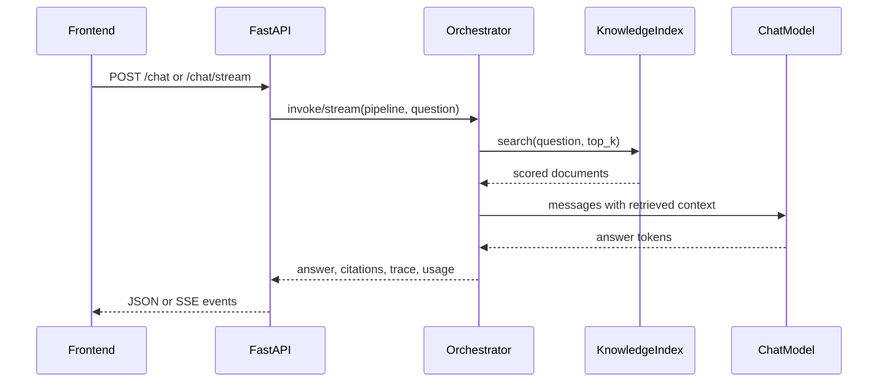

# Foundry Architecture

## 개요

Foundry는 문서 업로드, RAG 검색, LLM 답변 생성, citation/trace 반환, pipeline versioning, deployment endpoint를 하나의 local workbench로 제공한다.

## 구성 요소

| 영역 | 책임 |
| --- | --- |
| Frontend | Workbench UI, source upload, pipeline editor, playground, deployment 관리 |
| FastAPI API | REST/SSE endpoint, validation, error handling |
| SourceService | 문서 저장, text extraction, chunking, index rebuild |
| KnowledgeIndex | dense/sparse hybrid search와 result scoring |
| Orchestrator | RAG context 준비, chat model 호출, trace/citation 구성 |
| PipelineService | pipeline draft, immutable version, deployment metadata 관리 |
| ProviderService | provider credential 암호화 저장과 모델 목록 동기화 |

## RAG 실행 흐름

## 데이터 저장

- Pipeline, provider, source, conversation, deployment metadata는 relational DB에 저장한다.
- Uploaded source file은 local filesystem에 저장한다.
- Vector index는 설정에 따라 PostgreSQL+pgvector 또는 memory store를 사용한다.
- Provider secret은 암호화한 ciphertext만 DB에 저장한다.

## 운영 제약

- 현재 PoC는 인증과 tenant 격리를 포함하지 않는다.
- 로컬 파일 저장소는 production object storage로 교체해야 한다.
- SQLite와 memory vector store는 테스트와 smoke run 용도다.
