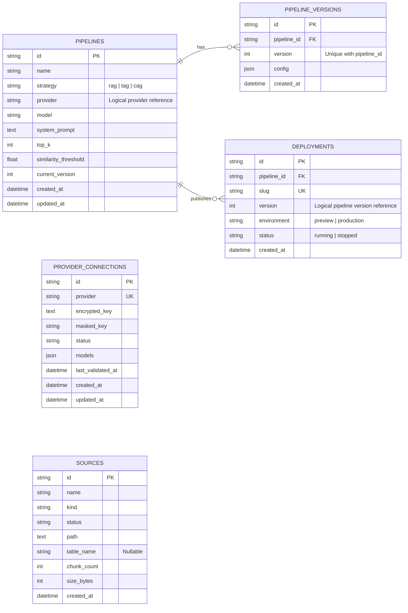

# LLMOps 기반 개인화 AI 챗봇 플랫폼 ERD

> 기준: `backend/src/foundry/models`의 현재 SQLAlchemy 모델  
> 범위: 인증을 제외한 PoC 메타데이터 스키마

## 데이터베이스 ERD

## 관계 및 제약조건

| 부모 | 자식 | 관계 | 삭제 정책 | 제약조건 |
|---|---|---|---|---|
| `pipelines` | `pipeline_versions` | 1:N | Pipeline 삭제 시 cascade | `(pipeline_id, version)` unique |
| `pipelines` | `deployments` | 1:N | Pipeline 삭제 시 cascade | `slug` unique |

## 구현상 주의점

- `pipelines.provider`는 `provider_connections.provider`를 논리적으로 참조하지만 물리 FK는 아니다. 서비스 계층에서 Provider와 모델 사용 가능 여부를 검증한다.
- `deployments.version`은 해당 Pipeline의 `pipeline_versions.version`을 논리적으로 참조한다. 현재 복합 FK는 없으며 조회 시 `(pipeline_id, version)`으로 버전 스냅샷을 찾는다.
- `deployments.environment`는 Preview/Production 노출 환경이고, `deployments.status`는 실행 상태다. `stopped` 상태의 public chat은 실행되지 않는다.
- `sources`는 현재 모든 Pipeline이 공유하는 전역 지식 소스다. Pipeline별 소스 선택 관계 테이블은 아직 없다.
- 문서·벡터 인덱스, TAG용 동적 테이블, CAG 캐시는 각각 파일 시스템·FAISS·SQLite 동적 테이블·프로세스 메모리에 저장되어 이 메타데이터 ERD에 포함되지 않는다.
- PoC 요구에 따라 사용자, 테넌트, 역할, 세션 등 인증 관련 엔티티는 포함하지 않았다.

## 목표 아키텍처와의 차이

운영 단계에서는 `tenant_id` 격리, Pipeline과 Source의 N:M 연결, Provider credential version, 실행 trace·사용량·비용, 평가 실행·케이스, 배포가 참조하는 불변 `pipeline_version_id`를 별도 마이그레이션으로 추가해야 한다. 이 항목들은 현재 코드에 없는 목표 모델이므로 위 ERD에는 선반영하지 않았다.
