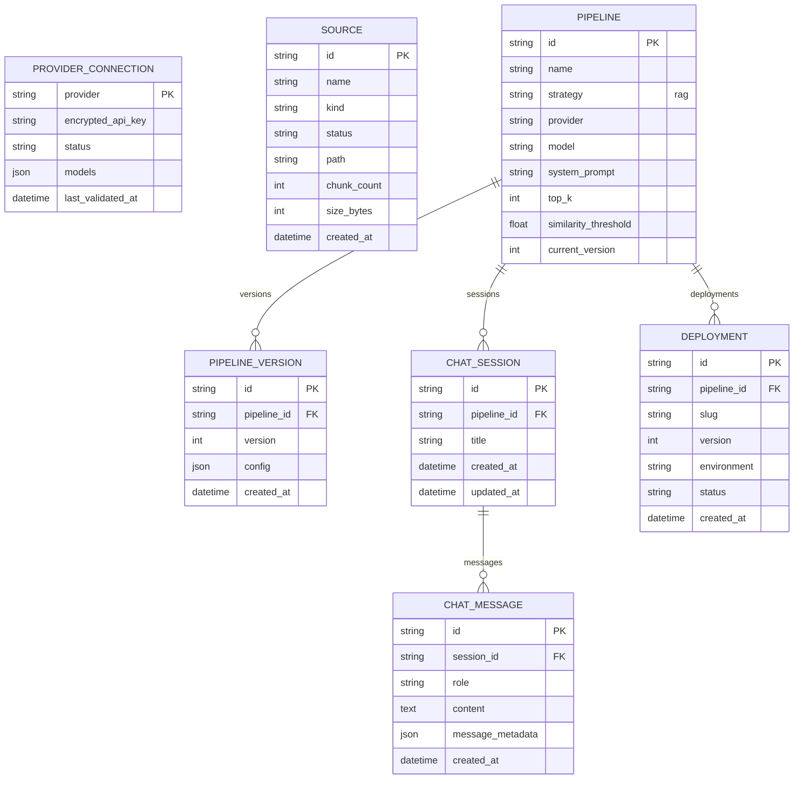

# Foundry ERD

## 핵심 엔티티

```mermaid
erDiagram
    PROVIDER_CONNECTION {
        string provider PK
        string encrypted_api_key
        string status
        json models
        datetime last_validated_at
    }

    SOURCE {
        string id PK
        string name
        string kind
        string status
        string path
        int chunk_count
        int size_bytes
        datetime created_at
    }

    PIPELINE {
        string id PK
        string name
        string strategy "rag"
        string provider
        string model
        string system_prompt
        int top_k
        float similarity_threshold
        int current_version
    }

    PIPELINE_VERSION {
        string id PK
        string pipeline_id FK
        int version
        json config
        datetime created_at
    }

    CHAT_SESSION {
        string id PK
        string pipeline_id FK
        string title
        datetime created_at
        datetime updated_at
    }

    CHAT_MESSAGE {
        string id PK
        string session_id FK
        string role
        text content
        json message_metadata
        datetime created_at
    }

    DEPLOYMENT {
        string id PK
        string pipeline_id FK
        string slug
        int version
        string environment
        string status
        datetime created_at
    }

    PIPELINE ||--o{ PIPELINE_VERSION : versions
    PIPELINE ||--o{ CHAT_SESSION : sessions
    PIPELINE ||--o{ DEPLOYMENT : deployments
    CHAT_SESSION ||--o{ CHAT_MESSAGE : messages
```

문서 chunk와 vector index는 선택한 vector store에 저장되며 이 metadata ERD에는 포함하지 않는다.
