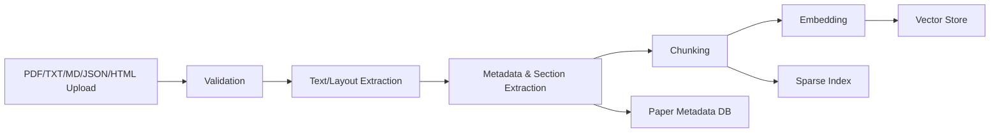
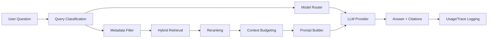
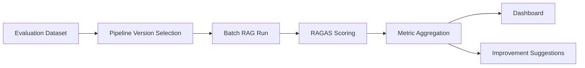

# Foundry PRD

Foundry는 컴퓨터/AI 관련 논문을 빠르게 탐색, 요약, 비교하고 근거 기반으로 질의응답하기 위한 개인용 RAG 기반 논문 정보 탐색 플랫폼이다. 기존의 문서 기반 RAG 파이프라인 구성, 평가, 버전 관리, 배포 기능을 유지하되, 논문 분석에 최적화된 PDF 처리, 멀티 LLM 연결, token 비용 최적화, RAGAS 기반 정량 평가 기능을 확장한다.

## 코드 분석 기준 구현 상태

이 PRD는 제품 목표와 확장 방향을 포함한다. 현재 코드 기준 상세 요구사항과 구현/추정/추가 제안 구분은 [요구사항 명세서](./REQUIREMENTS_SPEC.md)를 기준으로 한다.

현재 구현된 핵심 기능은 인증 없는 로컬 PoC 형태의 Provider 연결, Source 업로드와 indexing, RAG pipeline draft/version/rollback, RAG chat/SSE streaming, citation/trace/usage 반환, chat session, 기본 evaluation, deployment/public chat, `/status` token/provider quota 조회다.

현재 코드만으로 구현 완료로 볼 수 없는 기능은 사용자별 인증/권한, 정식 RAGAS metric 평가, 질문 난이도 기반 자동 모델 라우팅, 비용 최적화 추천, 논문 간 비교/실험 결과/한계점 추출 전용 기능이다. 해당 항목은 제품 목표 또는 추가 제안 기능으로 취급한다.

## 0. 3-Agent 팀 구성

| Agent | 선정 이유 | PRD 중점 수정 영역 |
| --- | --- | --- |
| Product Manager Agent | 기존 Foundry 기능을 삭제하지 않고 논문 탐색 플랫폼의 사용자 가치와 MVP 범위를 재정렬하기 위해 필요하다. | 제품 개요, 문제 정의, 페르소나, 핵심 가치, 사용자 시나리오, MVP/후순위 범위 |
| AI/RAG Architect Agent | OpenAI, Claude, Local Ollama를 하나의 RAG 실행 구조로 연결하고 논문 PDF 처리, 청킹, 검색, 재랭킹, 응답 생성을 설계하기 위해 필요하다. | 멀티 LLM 아키텍처, RAG 파이프라인, 모델 라우팅, token 비용 최적화, 데이터 흐름 |
| RAG Evaluation & QA Agent | RAG 품질을 감각이 아니라 RAGAS 지표로 측정하고 모델/프롬프트/청킹 전략을 비교하는 QA 루프를 설계하기 위해 필요하다. | RAGAS 평가 설계, 평가 데이터셋, 품질 기준, 대시보드, 성공 지표 |

## 1. 제품 개요

Foundry는 사용자가 논문 PDF와 보조 문서를 업로드하면 검색 가능한 knowledge index를 생성하고, 선택한 LLM 또는 자동 라우팅된 LLM을 통해 citation이 포함된 grounded answer를 제공하는 LLMOps workbench다.

제품은 기존 범용 문서 RAG PoC를 기반으로 하며, 주요 사용 맥락을 “내가 읽는 컴퓨터/AI 논문 분석”으로 특화한다. 사용자는 논문 내용 요약, 특정 개념 설명, 실험 결과 확인, 한계점 추출, 여러 논문 비교를 수행할 수 있어야 한다. 답변에는 source chunk, 논문 메타데이터, 섹션, 페이지 정보를 함께 제공해 사용자가 근거 문맥을 즉시 확인할 수 있어야 한다.

플랫폼은 OpenAI API, Claude API, Local Ollama 모델을 연결한다. 사용자는 직접 모델을 선택할 수 있고, 시스템은 질문 난이도, 작업 유형, 비용 설정, 로컬 우선 옵션에 따라 적절한 모델을 자동 라우팅할 수 있다. RAGAS를 도입해 Faithfulness, Answer Relevancy, Context Precision, Context Recall 등으로 검색 및 답변 품질을 정량 평가한다.

## 2. 문제 정의

컴퓨터/AI 논문은 분량이 길고, 수식, 표, 그림, 실험 설정, ablation, 한계점이 흩어져 있어 필요한 정보를 빠르게 찾기 어렵다. 일반 LLM 채팅만으로는 논문 원문에 근거한 답변인지 확인하기 어렵고, 긴 PDF 전체를 매번 모델에 넣으면 token 비용이 커진다.

사용자는 다음 문제를 겪는다.

- 논문 전체를 읽기 전에 핵심 기여, 방법론, 실험 결과, 한계점을 빠르게 파악하기 어렵다.
- 특정 용어, 모델 구조, 데이터셋, metric, baseline 비교 내용을 PDF에서 직접 찾는 데 시간이 든다.
- 여러 논문을 비교할 때 실험 조건과 결론이 서로 다른 섹션에 있어 정리가 번거롭다.
- LLM 답변이 논문 근거에 충실한지 확인할 수 있는 citation과 context가 필요하다.
- OpenAI나 Claude 같은 고성능 모델을 모든 질문에 쓰면 비용이 증가한다.
- Local Ollama 모델은 비용은 낮지만 답변 품질과 속도 차이를 관리해야 한다.
- RAG 품질 개선 시 어떤 청킹, 검색, 프롬프트, 모델 조합이 나은지 정량 근거가 부족하다.

## 3. 사용자 페르소나

주 페르소나는 컴퓨터/AI 관련 논문을 자주 읽고 구현 또는 연구 아이디어 탐색에 활용하는 개발자/연구 지향 사용자다. 이 제품의 1차 사용자는 “나”이며, 로컬 환경과 외부 API를 함께 사용할 수 있는 기술적 이해를 갖고 있다.

사용자 니즈:

- 논문 내용을 빠르게 이해하고 싶다.
- 특정 개념, 모델, 실험 결과, 한계점을 RAG로 질의하고 싶다.
- 여러 논문을 같은 기준으로 비교하고 싶다.
- 논문 기반 답변에서 근거 문맥, 페이지, 섹션, source chunk를 확인하고 싶다.
- API 비용을 줄이면서도 일정 수준 이상의 답변 품질을 유지하고 싶다.
- OpenAI, Claude, Local Ollama를 상황에 따라 선택적으로 사용하고 싶다.
- RAG 품질을 감각이 아니라 정량 지표로 평가하고 싶다.

## 4. 제품 목표

- 논문 PDF 업로드 후 자동으로 텍스트, 메타데이터, 섹션 구조, chunk, embedding, 검색 index를 생성한다.
- Provider, model, system prompt, top K, similarity threshold, context token limit, routing policy를 UI와 API에서 조정한다.
- 채팅 실행 시 답변, citation, source chunk, LangChain trace, token usage, 예상/실제 비용을 함께 확인한다.
- OpenAI, Claude, Ollama를 연결하고 작업 유형과 비용 정책에 따라 수동/자동 모델 선택을 지원한다.
- 파이프라인 draft를 immutable version으로 저장하고 deployment slug로 노출한다.
- RAGAS 평가를 실행해 모델별, 프롬프트별, chunking 전략별 검색 및 답변 품질을 비교한다.
- MVP 단계에서 인증 없는 local workbench 경험을 유지하되, 사용자별 API Key 등록 구조는 향후 인증 도입을 전제로 설계한다.

## 5. 핵심 가치 제안

- 근거 기반 논문 Q&A: 답변마다 논문 섹션, 페이지, chunk citation을 제공해 검증 가능한 탐색을 지원한다.
- 논문 분석 자동화: 요약, 개념 설명, 실험 결과 정리, 한계점/future work 추출, 논문 간 비교를 반복 가능한 workflow로 제공한다.
- 비용 제어 가능한 멀티 LLM: 고난도 분석에는 OpenAI/Claude, 단순 검색·짧은 요약에는 Ollama 또는 저비용 모델을 사용한다.
- RAG 품질의 정량 관리: RAGAS와 retrieval metric으로 청킹, 검색, 프롬프트, 모델 변경의 효과를 비교한다.
- LLMOps 기반 재현성: pipeline version, trace, evaluation result를 저장해 같은 논문과 설정에서 결과를 재현할 수 있다.

## 6. 기존 기능 유지 범위

기존 PRD와 기능 명세의 기능은 삭제하지 않고 유지한다. 신규 요구사항과 충돌하는 표현은 “유지하되 확장”한다.

| 기존 ID | 기능 | 유지/확장 방식 |
| --- | --- | --- |
| FR-01 / FS-001 | Provider 연결 | OpenAI, Anthropic/Claude, Ollama provider 연결과 모델 목록 동기화를 유지하고 사용자별 API Key 관리, 비용 정보, routing policy를 확장한다. |
| FR-02 / FS-002 | Source 관리 | TXT, Markdown, JSON, HTML, PDF 업로드·삭제를 유지하고 논문 PDF 메타데이터/섹션/페이지/chunk 구조화를 확장한다. |
| FR-03 / FS-005 | RAG 실행 | 문서 검색 결과 기반 grounded answer 생성을 유지하고 논문 특화 질의응답, citation/source chunk 표시, context token 제한을 확장한다. |
| FR-04 / FS-003 / FS-004 | Pipeline 관리 | draft 수정, immutable version 저장, rollback을 유지하고 모델 라우팅 정책, chunking strategy, prompt version을 versioned config에 포함한다. |
| FR-05 / FS-006 / FS-007 | Playground | 일반 채팅, SSE streaming, citation, trace 표시를 유지하고 token/cost, selected model, routing reason, RAGAS quick eval 결과를 표시한다. |
| FR-06 / FS-008 | Evaluation | 기본 test query, latency, cost, accuracy 요약을 유지하고 RAGAS 기반 Faithfulness, Answer Relevancy, Context Precision, Context Recall 평가로 확장한다. |
| FR-07 / FS-009 | Deployment | preview/production endpoint 생성과 실행 상태 관리를 유지하고 immutable pipeline version 및 routing policy 기준으로 배포한다. |
| FS-010 | Chat session 관리 | chat session 생성, 목록, 수정, 삭제, message 조회를 유지하고 논문 collection, 모델, 비용 사용량 메타데이터를 연결한다. |

범위 제외 항목 중 “자동 전략 라우팅”은 신규 핵심 요구사항으로 범위에 포함한다. “테이블 질의, SQL 생성, 동적 테이블 catalog”는 여전히 제외하되, 논문 PDF 내 표 추출 및 표 내용 설명은 논문 RAG 범위에 포함한다.

## 7. 신규 기능 요구사항

### 7.1 멀티 LLM 연결 기능

- OpenAI API 연동: chat, embedding, reranking 또는 judge model 사용을 지원한다.
- Claude API 연동: 긴 문맥 분석, 논문 비교, 복잡한 추론형 답변 생성에 사용한다.
- Local Ollama 연동: 로컬 우선 처리, 비용 없는 초안 생성, 간단한 요약/분류/질의응답에 사용한다.
- 사용자별 API Key 등록 및 관리: provider별 key/base URL/model list를 암호화 저장하고 연결 상태를 검증한다.
- 모델별 사용 가능 작업 정의: `qa`, `summary`, `comparison`, `extraction`, `evaluation_judge`, `embedding`, `rerank` capability를 모델 metadata로 관리한다.
- 모델 선택 UI: manual mode에서는 provider/model을 직접 선택한다.
- 자동 모델 라우팅: auto mode에서는 query classification, context length, task type, budget policy에 따라 모델을 선택한다.

### 7.2 Token 비용 절감 기능

- 질문 난이도 기반 모델 라우팅: simple lookup, summary, complex reasoning, multi-paper comparison 등으로 분류한다.
- Local Ollama 우선 처리 옵션: 사용자가 `local_first=true`를 켜면 지원 가능한 작업은 Ollama로 먼저 처리하고 실패 또는 낮은 confidence에서 API 모델로 fallback한다.
- 짧은 요약/긴 분석 모드: response budget과 prompt template을 분리한다.
- 검색 context 길이 제한: pipeline별 `max_context_tokens`, `reserved_output_tokens`를 설정한다.
- chunk top-k 조절: 질문 유형과 similarity score에 따라 top-k를 수동/자동 조정한다.
- 모델별 token 사용량 로깅: request별 input/output/retrieved context token, cache hit, provider, model을 기록한다.
- 예상 비용 및 실제 비용 표시: 실행 전 estimate와 실행 후 actual usage를 UI와 trace에 표시한다.
- 비용 최적화 추천: 비싼 모델 반복 사용, 과도한 top-k, 낮은 similarity threshold, 긴 system prompt를 탐지해 개선안을 제안한다.

### 7.3 논문 RAG 기능 강화

- 논문 PDF 업로드와 기존 TXT/Markdown/JSON/HTML/PDF source 관리를 함께 지원한다.
- 텍스트 추출: 제목, 초록, 본문, 참고문헌, 부록을 구분한다.
- 논문 메타데이터 추출: title, authors, venue, year, arXiv ID/DOI, abstract, keywords를 추출한다.
- 섹션 단위 구조화: Abstract, Introduction, Related Work, Method, Experiments, Results, Limitations, Future Work, References 등으로 구조화한다.
- 표, 수식, 그림 설명 처리: 표와 figure caption은 별도 chunk type으로 저장하고, 수식은 LaTeX 또는 원문 텍스트를 보존한다.
- 청킹 및 임베딩: 섹션/문단 경계를 우선하고 chunk overlap, metadata, parent section을 저장한다.
- 벡터 검색 및 hybrid search: dense vector search와 BM25/keyword search를 결합한다.
- 근거 문맥 기반 답변 생성: 답변은 retrieved context 내 정보에 근거하며 근거 부족 시 불확실성을 표시한다.
- citation/source chunk 표시: paper, section, page, chunk id, score를 UI와 API에 반환한다.
- 논문 요약: TL;DR, contribution, method, experiment, limitation, future work 형식의 structured summary를 제공한다.
- 논문 간 비교: 여러 논문을 선택해 contribution, architecture, dataset, metric, result, limitation 기준으로 비교한다.
- 개념 설명: 논문 내 정의와 주변 문맥을 근거로 용어/모델/알고리즘을 설명한다.
- 실험 결과 정리: dataset, baseline, metric, table/figure 근거를 포함해 정리한다.
- 한계점 및 future work 추출: 저자 명시 한계와 사용자가 추론 가능한 실무적 리스크를 구분한다.

### 7.4 RAGAS 기반 RAG 평가 기능

- RAGAS 도입: 평가 실행 시 question, answer, contexts, ground_truth를 기준으로 metric을 계산한다.
- 평가 데이터셋 생성: 논문별 seed question, 사용자 저장 질문, LLM 생성 후보 질문을 검토 후 평가셋으로 등록한다.
- 질문-정답-ground truth 관리: dataset item에는 paper_id, section_scope, question, ground_truth, expected_contexts, difficulty, tags를 저장한다.
- Faithfulness 평가: 답변이 retrieved context에 의해 뒷받침되는지 측정한다.
- Answer Relevancy 평가: 답변이 질문 의도에 직접적으로 대응하는지 측정한다.
- Context Precision 평가: 검색된 context 중 관련 context가 상위에 위치하는지 측정한다.
- Context Recall 평가: ground truth 답변에 필요한 context가 검색 결과에 포함되는지 측정한다.
- 모델별 평가 결과 비교: OpenAI, Claude, Ollama 및 모델 버전별 점수, 비용, latency를 비교한다.
- chunking 전략별 평가 결과 비교: chunk size, overlap, section-aware chunking, semantic chunking별 성능을 비교한다.
- 프롬프트 버전별 평가 결과 비교: prompt version별 RAGAS score와 regression 여부를 비교한다.
- 평가 결과 대시보드: metric trend, 실패 케이스, worst queries, 비용 대비 품질을 시각화한다.
- 평가 결과 기반 개선 제안: 낮은 recall, 낮은 faithfulness, 높은 비용 등 원인별 개선 액션을 제안한다.

## 8. 사용자 시나리오

### 8.1 논문 업로드 후 빠른 요약

1. 사용자가 논문 PDF를 업로드한다.
2. 시스템이 텍스트, 메타데이터, 섹션, 표/그림 caption, chunk를 생성한다.
3. 사용자가 `짧은 요약` 모드를 선택한다.
4. auto routing이 Ollama 또는 저비용 모델을 선택한다.
5. UI는 핵심 기여, 방법론, 실험, 한계점 요약과 citation을 표시한다.

### 8.2 특정 개념 질의응답

1. 사용자가 “이 논문에서 retrieval-augmented generation을 어떻게 정의해?”라고 질문한다.
2. 시스템이 query type을 `concept_explanation`으로 분류한다.
3. KnowledgeIndex가 section-aware hybrid search를 수행하고 top-k context를 반환한다.
4. Orchestrator가 context token limit 내에서 prompt를 구성한다.
5. 답변은 정의, 설명, 관련 섹션, source chunk를 포함한다.

### 8.3 여러 논문 비교

1. 사용자가 3개 논문을 선택하고 “데이터셋, baseline, 성능, 한계점을 비교해줘”라고 요청한다.
2. 시스템이 multi-paper comparison으로 분류한다.
3. context 길이와 추론 난이도를 고려해 Claude 또는 고성능 OpenAI 모델을 선택한다.
4. 결과는 비교 테이블, 논문별 citation, 불확실한 항목 표시를 포함한다.

### 8.4 비용 최적화 실행

1. 사용자가 월간 API 비용 한도와 `local_first` 옵션을 설정한다.
2. 단순 질문은 Ollama로 처리하고, 긴 분석만 API 모델로 라우팅한다.
3. UI는 질문별 예상 비용, 실제 비용, token usage를 보여준다.
4. 시스템은 “top_k가 높아 context 비용이 증가했다” 같은 추천을 제공한다.

### 8.5 RAGAS 평가와 개선

1. 사용자가 평가셋을 선택하고 pipeline version A/B를 비교한다.
2. 시스템이 각 pipeline으로 답변을 생성하고 RAGAS metric을 계산한다.
3. 대시보드는 Faithfulness, Answer Relevancy, Context Precision, Context Recall, latency, cost를 비교한다.
4. 낮은 Context Recall 케이스는 chunking 또는 retrieval threshold 개선 후보로 표시된다.

## 9. 기능 명세

| ID | 기능 | 우선순위 | 설명 |
| --- | --- | --- | --- |
| PRD-FR-001 | Provider 연결 | Must | OpenAI, Anthropic/Claude, Ollama 연결, credential 암호화 저장, 모델 목록 동기화 |
| PRD-FR-002 | Source 관리 | Must | TXT, MD, JSON, HTML, PDF 업로드/삭제/조회, 지원하지 않는 확장자는 422 반환 |
| PRD-FR-003 | 논문 PDF 파싱 | Must | PDF 텍스트, 메타데이터, 섹션, 표, 수식, figure caption 추출 |
| PRD-FR-004 | Knowledge index 생성 | Must | chunking, embedding, metadata 저장, dense/sparse hybrid index 생성 |
| PRD-FR-005 | Pipeline draft 관리 | Must | provider, model, prompt, top_k, threshold, context limit, routing policy 수정 |
| PRD-FR-006 | Pipeline version/rollback | Must | immutable version 저장, rollback, deployment와 version 연결 |
| PRD-FR-007 | RAG 채팅 | Must | 질문 기반 retrieval, grounded answer, citation, source chunk 반환 |
| PRD-FR-008 | SSE streaming | Must | `trace`, `token`, `citation`, `done`, `error` event 안정 제공 |
| PRD-FR-009 | Playground | Must | 질문 실행, 모델 선택, citation/trace/token/cost/routing reason 표시 |
| PRD-FR-010 | Chat session 관리 | Should | session 생성/목록/수정/삭제/message 조회, 논문 collection과 연결 |
| PRD-FR-011 | 멀티 LLM 자동 라우팅 | Must | 질문 유형, 난이도, 비용 정책, local_first 기반 모델 선택 |
| PRD-FR-012 | Token/cost 로깅 | Must | model별 input/output/context token, estimated/actual cost, latency 저장 |
| PRD-FR-013 | 논문 요약 | Must | TL;DR, contribution, method, experiment, limitation, future work 구조화 |
| PRD-FR-014 | 논문 간 비교 | Should | 여러 논문을 기준별로 비교하고 source citation 제공 |
| PRD-FR-015 | 실험 결과/한계점 추출 | Should | dataset, metric, baseline, result, limitation, future work 추출 |
| PRD-FR-016 | Evaluation 실행 | Must | test query 실행, latency, cost, accuracy, RAGAS metric 계산 |
| PRD-FR-017 | RAGAS 평가셋 관리 | Must | question, ground_truth, expected_contexts, difficulty, tags 관리 |
| PRD-FR-018 | 평가 대시보드 | Should | 모델/프롬프트/chunking별 RAGAS score, trend, 실패 케이스 표시 |
| PRD-FR-019 | Deployment 관리 | Should | preview/production endpoint 생성, run/stop/delete, public slug chat |
| PRD-FR-020 | 비용 최적화 추천 | Should | 과도한 token/context/model 사용 감지 및 개선 제안 |

기존 API 범위는 유지한다.

- `/api/v1/health`
- `/api/v1/providers`
- `/api/v1/sources`
- `/api/v1/pipelines`
- `/api/v1/chat`
- `/api/v1/chat/stream`
- `/api/v1/chat/sessions`
- `/api/v1/evaluations/run`
- `/api/v1/deployments`
- `/api/v1/public/{slug}/chat`

확장 API 후보:

- `POST /api/v1/sources/papers/upload`
- `GET /api/v1/papers/{paper_id}`
- `GET /api/v1/papers/{paper_id}/chunks`
- `POST /api/v1/chat/route-preview`
- `GET /api/v1/usage/llm`
- `POST /api/v1/evaluations/datasets`
- `GET /api/v1/evaluations/runs/{run_id}`
- `GET /api/v1/evaluations/compare`

## 10. 멀티 LLM 아키텍처

### 10.1 구성 요소

| 컴포넌트 | 책임 |
| --- | --- |
| ProviderService | provider credential 암호화 저장, base URL 관리, 모델 목록 동기화, 연결 상태 확인 |
| ModelRegistry | provider별 model id, capability, context window, pricing, local 여부, quality tier 관리 |
| RouterService | query classification, task difficulty, budget policy, local_first, fallback 기준으로 모델 선택 |
| Orchestrator | retrieval context 구성, prompt template 적용, LLM 호출, streaming, citation/trace/usage 구성 |
| UsageMeter | input/output/context token, latency, estimate/actual cost, cache hit 여부 기록 |
| FallbackController | provider timeout/rate limit/validation failure 시 대체 모델 또는 cached response 사용 |

### 10.2 Provider별 기본 역할

| Provider | 적합한 작업 | 주의점 |
| --- | --- | --- |
| OpenAI API | 일반 RAG Q&A, 빠른 고품질 요약, embedding, judge/evaluation | 비용 추적과 context limit 관리 필요 |
| Claude API | 긴 문맥 논문 비교, 복잡한 추론, 여러 논문 종합 분석 | latency와 비용이 커질 수 있으므로 고난도 작업에 제한 |
| Local Ollama | 단순 질의, 초안 요약, 키워드 추출, 로컬 우선 모드, 비용 없는 반복 실험 | 모델별 품질 편차가 크므로 confidence/fallback 필요 |

### 10.3 라우팅 정책

입력 신호:

- `task_type`: `lookup`, `concept_explanation`, `summary_short`, `summary_deep`, `comparison`, `experiment_extraction`, `limitation_extraction`, `evaluation_judge`
- `difficulty`: `low`, `medium`, `high`
- `context_tokens_estimate`
- `paper_count`
- `requires_long_context`
- `user_mode`: `manual`, `auto`, `local_first`, `lowest_cost`, `best_quality`
- `budget_remaining`
- provider health, rate limit, timeout 상태

기본 라우팅:

| 조건 | 기본 모델 선택 |
| --- | --- |
| manual mode | 사용자가 지정한 provider/model 사용 |
| local_first + low difficulty | Ollama 우선, 낮은 confidence 또는 실패 시 OpenAI/Claude fallback |
| short summary 또는 lookup | Ollama 또는 저비용 OpenAI 모델 |
| concept explanation | OpenAI 기본, context가 짧으면 Ollama 가능 |
| long analysis 또는 multi-paper comparison | Claude 또는 고성능 OpenAI 모델 |
| evaluation judge | RAGAS 설정의 judge model 사용, 비용 모드에서는 저비용 judge 사용 |
| provider 장애/rate limit | 동일 capability의 대체 provider 사용 |

라우팅 결과는 `selected_provider`, `selected_model`, `routing_reason`, `estimated_cost`, `fallback_used`로 trace에 기록한다.

## 11. RAG 파이프라인

### 11.1 논문 ingestion

1. Source upload: 사용자가 PDF 또는 기존 지원 문서 형식을 업로드한다.
2. File validation: 확장자, 크기, 중복 hash, MIME type을 확인한다.
3. PDF parsing: Docling 또는 pypdf 기반 parser로 텍스트, page, layout block을 추출한다.
4. Metadata extraction: title, authors, abstract, year, DOI/arXiv ID, references를 추출한다.
5. Section segmentation: heading hierarchy를 감지해 section/subsection 구조를 만든다.
6. Table/formula/figure handling: table은 markdown table 또는 structured text, formula는 LaTeX/text, figure는 caption 중심 chunk로 저장한다.
7. Chunking: section-aware chunking을 기본으로 사용하고 paragraph boundary를 보존한다.
8. Embedding: chunk text와 metadata를 embedding하여 vector store에 저장한다.
9. Index rebuild: dense vector index와 sparse keyword index를 갱신한다.

### 11.2 Chunking 전략

- 기본 chunk size: 500-900 tokens
- overlap: 80-150 tokens
- section boundary 우선: 서로 다른 section을 한 chunk에 섞지 않는다.
- parent-child 관계: document, section, paragraph/chunk를 연결한다.
- chunk metadata: `paper_id`, `source_id`, `section_title`, `section_type`, `page_start`, `page_end`, `chunk_type`, `token_count`, `embedding_model`, `parser_version`
- 특수 chunk: abstract, table, figure caption, formula, limitation, experiment result는 `chunk_type`으로 구분한다.

### 11.3 Retrieval 전략

- Metadata pre-filter: 선택 논문, collection, year, section_type, chunk_type으로 검색 범위를 줄인다.
- Hybrid search: dense vector similarity와 BM25 keyword score를 결합한다.
- Candidate retrieval: top 20-50 후보를 가져온다.
- Reranking: cross-encoder 또는 LLM reranker로 최종 top-k를 재정렬한다.
- Context compression: max_context_tokens 초과 시 관련 문장 추출 또는 chunk summary를 사용한다.
- Citation packaging: 최종 context마다 paper title, section, page, chunk id, score를 포함한다.

### 11.4 Answer generation

- Prompt는 system prompt, user question, selected contexts, citation instruction, output schema로 구성한다.
- 모델 응답은 가능하면 structured output으로 검증한다.
- 답변은 “근거 있음”, “근거 부족”, “논문에 명시되지 않음”을 구분한다.
- 모든 factual claim은 최소 하나의 source chunk와 연결해야 한다.
- SSE streaming에서는 token과 함께 trace, citation, done, error event를 제공한다.

## 12. Token 비용 최적화 전략

### 12.1 비용 제어 설정

| 설정 | 설명 |
| --- | --- |
| `monthly_budget_limit` | 월간 API 비용 한도 |
| `per_request_budget_limit` | 요청당 비용 한도 |
| `local_first` | 가능한 작업을 Ollama로 우선 처리 |
| `response_mode` | `short`, `balanced`, `deep` |
| `max_context_tokens` | 검색 context 최대 token 수 |
| `reserved_output_tokens` | 답변 생성을 위해 남겨둘 token 수 |
| `top_k_min/top_k_max` | 자동 top-k 조절 범위 |
| `similarity_threshold` | 낮은 관련도 chunk 제외 기준 |
| `cache_policy` | embedding, retrieval result, deterministic summary cache 정책 |

### 12.2 최적화 기법

- Query classification으로 단순 lookup은 작은 모델 또는 Ollama를 사용한다.
- Retrieval candidate는 넓게 가져오되 LLM context에는 reranked top-k만 넣는다.
- section filter를 사용해 필요 없는 References, Appendix, Related Work chunk를 제외할 수 있다.
- 긴 분석은 먼저 map 단계에서 논문별 요약을 만든 뒤 reduce 단계에서 비교한다.
- 반복 질문은 retrieval result와 summary cache를 활용한다.
- prompt template을 간결하게 유지하고 citation instruction을 표준화한다.
- token estimate를 실행 전에 계산해 비용 초과 시 사용자에게 축약 옵션을 제공한다.
- UsageMeter가 model별 cost per answer, cost per successful eval, cost per paper summary를 집계한다.

### 12.3 비용 최적화 추천 예시

- “현재 top_k=12로 평균 context token이 8,000을 초과합니다. top_k=6 또는 similarity_threshold 상향을 권장합니다.”
- “이 질문 유형은 lookup으로 분류되었습니다. Ollama 또는 저비용 모델로도 처리 가능합니다.”
- “Claude 사용량의 70%가 짧은 요약 요청입니다. short summary 기본 모델을 Ollama로 변경하세요.”
- “Faithfulness는 높지만 Context Recall이 낮습니다. 비용을 늘리기 전에 chunking과 retrieval threshold를 조정하세요.”

## 13. RAGAS 평가 설계

### 13.1 평가 단위

평가는 `evaluation_dataset`, `evaluation_run`, `evaluation_result`로 관리한다.

- Dataset item: `question`, `ground_truth`, `expected_contexts`, `paper_ids`, `section_scope`, `difficulty`, `tags`
- Run config: `pipeline_version`, `provider/model`, `routing_policy`, `prompt_version`, `chunking_strategy`, `top_k`, `similarity_threshold`, `judge_model`
- Result: `answer`, `retrieved_contexts`, `citations`, `ragas_scores`, `latency_ms`, `token_usage`, `cost`, `failure_reason`

### 13.2 RAGAS metric

| Metric | 목적 | 활용 방식 |
| --- | --- | --- |
| Faithfulness | 답변이 retrieved context에 의해 뒷받침되는지 측정 | hallucination 탐지, release gate |
| Answer Relevancy | 답변이 질문 의도에 직접 대응하는지 측정 | prompt 품질과 모델 응답성 비교 |
| Context Precision | 관련 context가 상위 검색 결과에 있는지 측정 | reranking, top-k, threshold 튜닝 |
| Context Recall | ground truth에 필요한 context가 검색되었는지 측정 | chunking, embedding, query expansion 개선 |

보조 metric:

- Retrieval Recall@K, MRR, NDCG
- Citation coverage
- Unsupported claim count
- Latency p50/p95
- Cost per answer
- Token usage by provider/model

### 13.3 평가 데이터셋 생성

1. 논문별 기본 질문 template을 생성한다.
   - “이 논문의 핵심 기여는 무엇인가?”
   - “사용한 데이터셋과 metric은 무엇인가?”
   - “baseline 대비 성능 개선은 어디에 나타나는가?”
   - “저자가 언급한 한계점은 무엇인가?”
2. 사용자가 실제 chat에서 중요 질문을 평가셋으로 저장한다.
3. LLM이 section별 후보 질문과 ground truth 초안을 생성한다.
4. 사용자가 ground truth와 expected contexts를 검토/승인한다.
5. difficulty와 tags를 지정한다.

### 13.4 비교 실험

- 모델별 비교: OpenAI vs Claude vs Ollama, 모델 버전별 품질/비용/latency 비교
- 프롬프트별 비교: prompt v1/v2/v3의 RAGAS score와 failure case 비교
- chunking별 비교: fixed-size, section-aware, semantic chunking의 Context Precision/Recall 비교
- retrieval별 비교: vector only, BM25 only, hybrid, rerank on/off 비교
- 비용 모드별 비교: `lowest_cost`, `balanced`, `best_quality`, `local_first` 비교

### 13.5 출시/변경 gate

- MVP release gate:
  - Faithfulness 평균 0.80 이상
  - Answer Relevancy 평균 0.75 이상
  - Context Precision 평균 0.70 이상
  - Context Recall 평균 0.70 이상
  - citation coverage 95% 이상
- Regression gate:
  - 기존 baseline 대비 주요 metric이 5%p 이상 하락하면 release candidate 경고
  - 비용이 30% 이상 증가하면서 품질 개선이 3%p 미만이면 비용 경고

## 14. 관리자/사용자 설정

### 14.1 Provider 설정

- provider: `openai`, `anthropic`, `ollama`
- API key 또는 local base URL
- default model
- enabled capability
- model pricing
- monthly/per-request budget
- health check status

### 14.2 Pipeline 설정

- name
- strategy: `rag`
- provider/model 또는 routing policy
- system prompt
- prompt version
- top_k
- similarity_threshold
- max_context_tokens
- chunking_strategy
- embedding_model
- reranker 설정
- response_mode
- evaluation dataset binding

### 14.3 사용자 설정

- 기본 응답 모드: short/balanced/deep
- 기본 모델 모드: manual/auto/local_first/lowest_cost/best_quality
- citation 표시 방식
- 비용 경고 threshold
- local Ollama endpoint
- 평가 judge model

## 15. 비기능 요구사항

- 보안: provider secret은 plaintext로 저장하지 않고 ciphertext만 DB에 저장한다.
- 개인정보/논문 데이터 보호: 로컬 파일 저장소를 기본으로 하며, 외부 provider로 전송되는 context 범위를 사용자에게 명확히 표시한다.
- 안정성: provider timeout, rate limit, invalid response에 circuit breaker와 fallback을 적용한다.
- 성능: 단일 논문 업로드 후 index 생성 상태를 progress로 표시하고, 채팅은 SSE streaming을 지원한다.
- 재현성: pipeline version, prompt version, model id, routing result, retrieved chunk id를 trace로 저장한다.
- 관측성: latency, token usage, cost, retrieval score, RAGAS score를 run 단위로 기록한다.
- 확장성: SQLite/memory store는 smoke run 용도이며 production은 PostgreSQL+pgvector 또는 Chroma 등으로 교체 가능해야 한다.
- 검증: backend test, frontend verify, RAGAS regression run을 release 전 실행한다.

## 16. 데이터 흐름

### 16.1 Ingestion flow

### 16.2 Query flow

### 16.3 Evaluation flow

## 17. 성공 지표

제품 사용 지표:

- 논문 업로드 후 첫 요약 생성까지 걸리는 시간
- 논문당 평균 질문 수
- citation 클릭률
- 논문 비교 기능 사용률
- chat session 재방문율

품질 지표:

- Faithfulness 평균/하위 10% 점수
- Answer Relevancy 평균
- Context Precision/Recall
- citation coverage
- unsupported claim count

비용/성능 지표:

- 질문당 평균 token usage
- 질문당 평균 비용
- provider/model별 비용 비중
- Ollama 처리 비율
- latency p50/p95
- cache hit rate

운영 지표:

- provider failure rate
- fallback 사용률
- evaluation regression 발생 수
- deployment endpoint 성공률

## 18. MVP 범위

MVP는 “개인용 논문 RAG workbench에서 PDF 업로드, grounded Q&A, 멀티 LLM 선택/라우팅, 기본 RAGAS 평가까지 end-to-end로 동작”하는 것을 목표로 한다.

### Must

- 기존 Provider, Source, Pipeline, Chat, Streaming, Citation, Trace, Evaluation, Deployment, Chat session 기능 보존
- OpenAI, Anthropic/Claude, Ollama provider 연결 및 모델 목록 동기화
- 논문 PDF 업로드, 텍스트/메타데이터/섹션 추출
- section-aware chunking, embedding, hybrid search
- citation/source chunk 기반 RAG 답변
- manual model selection과 기본 auto routing
- token usage와 actual cost 로깅
- short/balanced/deep response mode
- RAGAS dataset 관리와 Faithfulness, Answer Relevancy, Context Precision, Context Recall 평가
- 평가 결과의 기본 테이블/차트 표시

### Should

- Local Ollama 우선 처리와 fallback
- 모델별/프롬프트별/chunking별 비교 평가
- 비용 estimate와 비용 최적화 추천
- 논문 간 비교
- 실험 결과, 한계점, future work 추출
- evaluation regression gate

### Could

- figure/table 전용 뷰어
- LLM 기반 query expansion/HyDE
- advanced reranker 설정 UI
- 평가 실패 케이스 자동 클러스터링
- Zotero/arXiv/Semantic Scholar 연동

## 19. 후순위 개선 과제

- 인증과 multi-user tenant 격리
- 사용자별 API Key vault와 organization-level budget 관리
- production object storage 연동
- PDF layout parser 고도화 및 OCR 지원
- 논문 figure/table 원본 위치 하이라이트
- Notebook 스타일 논문 분석 report 생성
- fine-tuned embedding 또는 domain-specific reranker 실험
- offline-only mode 강화
- 팀 공유 collection과 annotation
- CI에 RAGAS regression test 자동 실행
- public deployment endpoint의 rate limit, auth token, audit log

## 20. 리스크 및 대응 방안

| 리스크 | 영향 | 대응 |
| --- | --- | --- |
| PDF 파싱 품질이 낮아 section/chunk가 깨짐 | 검색 recall과 citation 신뢰도 하락 | parser version 관리, page/section metadata 검증, 수동 chunk inspect UI 제공 |
| Ollama 모델 품질 편차 | local_first 답변 품질 저하 | confidence threshold, fallback, RAGAS로 local model benchmark 제공 |
| API 비용 증가 | 사용 지속성 저하 | token/cost logging, budget limit, context limit, 비용 최적화 추천 |
| RAGAS judge model 비용 | 평가 비용 증가 | 샘플링 평가, 저비용 judge, nightly batch, cache 적용 |
| LLM hallucination | 잘못된 논문 해석 | citation 필수화, faithfulness gate, 근거 부족 답변 정책 |
| provider 장애/rate limit | 채팅 실패 | circuit breaker, retry, fallback provider, cached summary |
| 평가셋 ground truth 품질 부족 | 잘못된 품질 판단 | 사용자 검토/승인 workflow, expected context 관리 |
| 긴 논문 비교의 context 초과 | 답변 누락 또는 비용 증가 | map-reduce 요약, section filter, context compression |

## 부록 A. 기존 기능 유지 목록

- OpenAI, Anthropic, Ollama provider 연결과 모델 목록 동기화
- TXT, Markdown, JSON, HTML, PDF 업로드·삭제
- 문서 검색 결과를 context로 사용하는 RAG 실행
- Pipeline draft 생성·수정
- Pipeline immutable version 저장과 rollback
- 일반 채팅과 SSE streaming
- citation, trace, token usage 반환
- 기본 evaluation 실행과 latency, cost, accuracy 요약
- preview/production deployment endpoint 관리
- public slug chat
- Chat session 생성, 목록, 수정, 삭제, message 조회

## 부록 B. 신규 기능 추가 목록

- 컴퓨터/AI 논문 분석 페르소나와 논문 중심 사용자 시나리오
- 논문 PDF 메타데이터, 섹션, 표, 수식, figure caption 추출
- 논문 요약, 개념 설명, 실험 결과 정리, 한계점/future work 추출
- 논문 간 비교
- 사용자별 API Key와 provider/model capability 관리
- manual/auto/local_first/lowest_cost/best_quality 모델 선택 모드
- 질문 난이도 기반 멀티 LLM 라우팅
- context token limit, response mode, top-k 자동 조절
- 모델별 token/cost 로깅과 예상/실제 비용 표시
- 비용 최적화 추천
- RAGAS 평가셋 생성 및 question-ground truth-expected context 관리
- Faithfulness, Answer Relevancy, Context Precision, Context Recall 평가
- 모델별, 프롬프트별, chunking 전략별 평가 비교
- 평가 결과 대시보드와 개선 제안

## 부록 C. MVP 우선순위와 확장 로드맵

### MVP 우선순위

1. 기존 Foundry 기능 회귀 없이 Provider/Source/Pipeline/Chat/Evaluation/Deployment 흐름 유지
2. 논문 PDF ingestion과 section-aware chunking 구현
3. citation/source chunk가 포함된 논문 RAG Q&A 구현
4. OpenAI, Claude, Ollama 수동 선택과 기본 auto routing 구현
5. token usage, latency, actual cost logging 구현
6. RAGAS 기본 4개 metric 평가와 결과 저장 구현
7. Playground에서 selected model, routing reason, citation, token/cost, trace 표시

### 추후 확장 로드맵

1. local_first fallback과 비용 최적화 추천 고도화
2. 논문 간 비교, 실험 결과 표 추출, limitation/future work 자동 리포트
3. 평가 대시보드 고도화와 regression gate 자동화
4. advanced retrieval: query expansion, HyDE, reranker, semantic chunking 실험 UI
5. arXiv/Semantic Scholar/Zotero 연동
6. 인증, tenant, 공유 collection, production deployment 보안 강화
