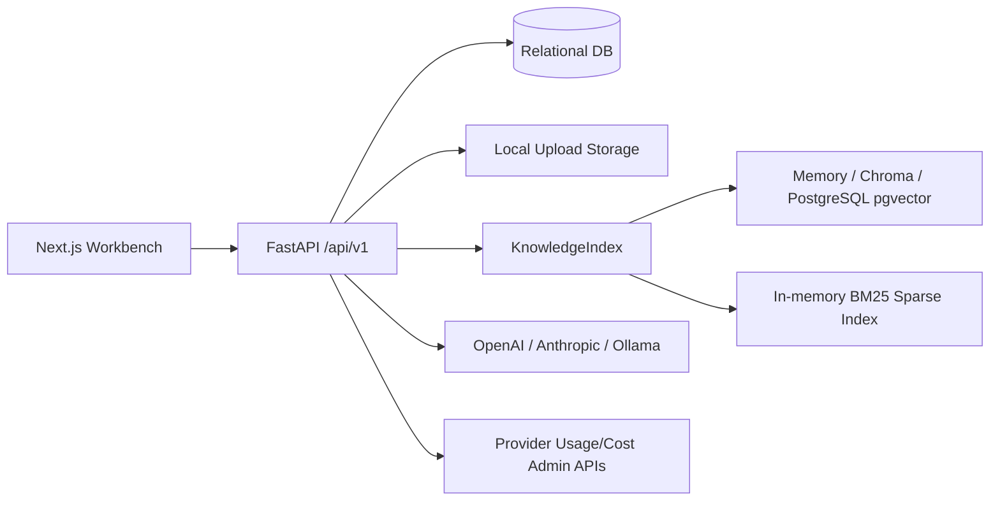

# Foundry 요구사항 명세서

## 1. 3-Agent 팀 구성 및 선정 이유

| Agent | 선정 이유 | 주요 산출 관점 |
| --- | --- | --- |
| Product Requirements Analyst Agent | 코드와 기존 PRD를 제품 요구사항으로 재구성해 기획자와 PM이 이해할 수 있는 문제, 사용자, MVP 범위를 정의하기 위해 선정했다. | 제품 목적, 사용자 페르소나, 시나리오, 우선순위, MVP 범위 |
| Software Architect & Backend Agent | FastAPI 라우터, 서비스, SQLAlchemy 모델, LangChain RAG 흐름, Docker/환경 설정을 기준으로 실제 구현 기능을 판별하기 위해 선정했다. | API, 데이터 모델, 백엔드 서비스, RAG 파이프라인, 배포/인프라 |
| QA & Documentation Agent | 요구사항을 테스트 가능한 형태로 정리하고, 코드에서 확인되지 않은 기능을 `추정`, `확인 필요`, `추가 제안`으로 분리하기 위해 선정했다. | Acceptance Criteria, 예외 처리, 테스트 범위, 리스크, 확인 필요 사항 |

## 2. 프로젝트 분석 요약

### 분석 근거 파일

- 프로젝트 설명 및 실행: [README.md](/Users/hwangbyeonghyeon/Desktop/project/RAG_Platform/README.md), [backend/README.md](/Users/hwangbyeonghyeon/Desktop/project/RAG_Platform/backend/README.md), [frontend/README.md](/Users/hwangbyeonghyeon/Desktop/project/RAG_Platform/frontend/README.md)
- 기존 문서: [docs/PRD.md](/Users/hwangbyeonghyeon/Desktop/project/RAG_Platform/docs/PRD.md), [docs/FUNCTIONAL_SPEC.md](/Users/hwangbyeonghyeon/Desktop/project/RAG_Platform/docs/FUNCTIONAL_SPEC.md), [docs/ARCHITECTURE.md](/Users/hwangbyeonghyeon/Desktop/project/RAG_Platform/docs/ARCHITECTURE.md), [docs/API_SPEC.md](/Users/hwangbyeonghyeon/Desktop/project/RAG_Platform/docs/API_SPEC.md), [docs/TECH_STACK.md](/Users/hwangbyeonghyeon/Desktop/project/RAG_Platform/docs/TECH_STACK.md)
- 백엔드 엔드포인트: [backend/src/foundry/api/v1/endpoints](/Users/hwangbyeonghyeon/Desktop/project/RAG_Platform/backend/src/foundry/api/v1/endpoints)
- 백엔드 서비스: [backend/src/foundry/services](/Users/hwangbyeonghyeon/Desktop/project/RAG_Platform/backend/src/foundry/services)
- 데이터 모델/스키마: [backend/src/foundry/models](/Users/hwangbyeonghyeon/Desktop/project/RAG_Platform/backend/src/foundry/models), [backend/src/foundry/schemas](/Users/hwangbyeonghyeon/Desktop/project/RAG_Platform/backend/src/foundry/schemas)
- 프론트엔드 API/화면: [frontend/src/lib/api.ts](/Users/hwangbyeonghyeon/Desktop/project/RAG_Platform/frontend/src/lib/api.ts), [frontend/src/components/views](/Users/hwangbyeonghyeon/Desktop/project/RAG_Platform/frontend/src/components/views)
- 환경/배포: [backend/.env.example](/Users/hwangbyeonghyeon/Desktop/project/RAG_Platform/backend/.env.example), [frontend/.env.local.example](/Users/hwangbyeonghyeon/Desktop/project/RAG_Platform/frontend/.env.local.example), [backend/compose.yaml](/Users/hwangbyeonghyeon/Desktop/project/RAG_Platform/backend/compose.yaml), [backend/Dockerfile](/Users/hwangbyeonghyeon/Desktop/project/RAG_Platform/backend/Dockerfile), [frontend/Dockerfile](/Users/hwangbyeonghyeon/Desktop/project/RAG_Platform/frontend/Dockerfile)
- 테스트: [backend/tests/test_api.py](/Users/hwangbyeonghyeon/Desktop/project/RAG_Platform/backend/tests/test_api.py), [backend/tests/test_cag_eval.py](/Users/hwangbyeonghyeon/Desktop/project/RAG_Platform/backend/tests/test_cag_eval.py), [backend/tests/test_local_bootstrap.py](/Users/hwangbyeonghyeon/Desktop/project/RAG_Platform/backend/tests/test_local_bootstrap.py)

### 프로젝트 한줄 요약

Foundry는 인증이 꺼진 로컬 PoC 형태의 FastAPI/Next.js 기반 RAG workbench다. 사용자는 provider key 또는 Ollama base URL을 등록하고, 문서를 업로드해 knowledge index를 만든 뒤, RAG pipeline을 구성하고 Playground에서 citation, trace, token usage가 포함된 답변을 검증하며, 특정 pipeline version을 deployment endpoint로 노출할 수 있다.

### 코드 기준 상태

- 실제 구현: Provider 연결, 문서 업로드/인덱싱, RAG pipeline 관리, chat/SSE streaming, citation/trace, chat session, 기본 evaluation, deployment/public chat, `/status` token/provider quota command.
- 부분 구현: 논문 PDF 처리. Docling metadata, heading, page, label 추출은 있으나 PRD의 논문 비교, 실험 결과 추출, 한계점 추출 전용 기능은 별도 API/화면으로 확인되지 않는다.
- 미구현 또는 추가 계획: 회원가입/로그인, 사용자/권한 관리, 관리자 화면, judge-model 기반 정식 RAGAS metric 평가, 비용 최적화 추천, workspace/project 관리.

## 3. 실제 확인된 기능 목록

| 범주 | 확인된 기능 | 근거 |
| --- | --- | --- |
| 시스템 상태 | `/health`에서 service, version, `auth_enabled=false` 반환 | `health.py`, `schemas/system.py`, `test_health_explicitly_reports_auth_disabled` |
| Provider 관리 | OpenAI, Anthropic, Ollama 연결/해제/모델 목록 갱신, credential 암호화 저장, masked key 반환 | `providers.py`, `services/providers.py`, `models/provider_connection.py` |
| Source 관리 | `.txt`, `.md`, `.json`, `.html`, `.pdf` 업로드, 삭제, 목록 조회 | `sources.py`, `services/sources.py`, `SourcesView` |
| PDF 처리 | `docling` 또는 `pypdf` parser, Docling chunk metadata, page/headings/labels 추출, 빈 PDF는 `no_text` 상태 저장 | `services/sources.py`, `test_pdf_upload_*` |
| Knowledge index | local/hash, Hugging Face, OpenAI embedding 지원. memory, Chroma, PostgreSQL/pgvector vector store 지원. BM25 sparse index와 RRF fusion 검색 | `services/knowledge.py`, `.env.example` |
| Pipeline 관리 | pipeline 생성/조회/수정/삭제, version 저장, rollback 시 새 head version 생성 | `pipelines.py`, `services/pipelines.py`, `PipelineView` |
| RAG 실행 | LangGraph 기반 route/rewrite/tool selection/retrieval/rerank/context grading, OpenAI/Anthropic/Ollama chat model 호출, citation/trace/usage 반환 | `chat.py`, `endpoints/rag.py`, `services/langgraph_workflow.py`, `services/orchestrator.py` |
| SSE streaming | `trace`, `token`, `citation`, `done`, `error` event 제공 | `chat.py`, `streamChat` |
| Chat session | session 생성/조회/이름 변경/삭제, message 저장, 최근 12개 history 사용 | `conversations.py`, `services/conversations.py`, `PlaygroundView` |
| Token status | `/status` 채팅 명령으로 session token usage와 provider quota status 반환 | `chat.py`, `provider_quota.py`, `test_status_command_*` |
| Evaluation | pipeline에 기본 또는 사용자 test query를 실행하고 latency, estimated cost, citation 기반 accuracy proxy 반환 | `evaluation.py`, `schemas/evaluation.py`, `test_cag_eval.py` |
| Deployment | pipeline 현재 version을 slug로 배포, preview/production 환경, running/stopped 상태 관리, public chat endpoint 제공 | `deployments.py`, `public.py`, `DeploymentsView` |
| Local bootstrap | demo provider/source/pipeline/deployment를 idempotent하게 생성 | `cli.py`, `test_local_bootstrap.py` |

## 4. 추정 기능 및 확인 필요 사항

| 항목 | 분류 | 설명 |
| --- | --- | --- |
| 사용자별 API Key | 확인 필요 | Provider credential 저장은 구현되어 있으나 인증/사용자 모델이 없어 “사용자별” 격리는 현재 확인되지 않는다. |
| 관리자 기능 | 확인 필요 | Admin API key를 이용한 provider quota 조회는 있으나 관리자 권한/관리자 화면은 없다. |
| Workspace/Project 관리 | 추가 제안 | 현재 UI는 `Personal lab` 문구만 있으며 별도 workspace entity/API는 없다. |
| RAGAS 호환 평가 | 부분 구현 | `POST /evaluations/ragas`가 RAGAS dataset 형식으로 pipeline을 실행하고 Faithfulness, Answer Relevancy, Context Precision, Context Recall proxy score를 JSON 저장한다. judge-model 기반 `ragas.evaluate()` 연결은 후속 작업이다. |
| 자동 모델 라우팅 | 추가 제안 | pipeline provider/model은 수동 설정이며 query difficulty 기반 라우터는 없다. |
| 비용 최적화 추천 | 추가 제안 | token usage와 provider quota status 일부는 있으나 비용 추천 엔진은 없다. |
| 논문 비교/실험 결과/한계점 추출 | 추가 제안 | PDF metadata와 chunking은 있으나 전용 분석 API/화면은 확인되지 않는다. |
| 운영 CI/CD | 확인 필요 | Dockerfile/compose는 있으나 `.github/workflows` 등 CI/CD 설정은 확인되지 않는다. |

## 5. 최종 요구사항 명세서

### 5.1 문서 개요

| 항목 | 내용 |
| --- | --- |
| 문서 목적 | 현재 코드 기준으로 Foundry의 제품 목적, 사용자, 기능/비기능 요구사항, 데이터 흐름, API, 화면, 테스트 기준, 리스크를 정의한다. |
| 대상 독자 | 기획자, PM, 백엔드/프론트엔드 개발자, QA 담당자, 기술 리드 |
| 분석 범위 | 현재 폴더 전체. 특히 `docs`, `backend`, `frontend`, `scripts`, `tools`, `wireframes`, `journal`, `outputs`를 확인했다. |
| 작성 기준 | 코드에서 확인된 기능을 우선 명세하고, 코드만으로 확정 불가능한 항목은 `확인 필요`, 현재 없는 기능은 `추가 제안`으로 분리한다. |

### 5.2 프로젝트 개요

| 항목 | 내용 |
| --- | --- |
| 프로젝트명 | Foundry / RAG Platform |
| 서비스 목적 | 문서를 업로드하고 RAG pipeline을 구성해 근거 기반 LLM 답변을 검증, 버전 관리, 배포하는 local workbench 제공 |
| 해결하려는 문제 | 문서 기반 Q&A를 만들 때 provider key, 문서 indexing, retrieval 설정, prompt, citation, trace, evaluation, deployment가 흩어져 있어 실험과 검증이 어렵다. |
| 핵심 사용자 | RAG/LLM 기능을 실험하는 개발자, AI product builder, 연구 지향 사용자 |
| 핵심 가치 제안 | 로컬에서 문서 업로드부터 RAG 답변, citation/trace 확인, pipeline versioning, deployment endpoint까지 한 흐름으로 검증한다. |
| 주요 사용 시나리오 | provider 연결, source 업로드, pipeline 생성/튜닝, Playground 질문, session 관리, evaluation 실행, deployment 생성 |

### 5.3 기술 스택 분석

| 영역 | 확인된 기술 | 근거 |
| --- | --- | --- |
| Frontend | Next.js 15 App Router, React 19, TypeScript, global CSS | `frontend/package.json`, `frontend/src/app`, `frontend/src/components` |
| Backend | Python 3.12, FastAPI, Pydantic, SQLAlchemy async, Uvicorn | `backend/pyproject.toml`, `main.py` |
| Database/Storage | SQLite 기본값, Docker compose PostgreSQL, uploaded files local filesystem, Chroma persist dir, pgvector 가능 | `config.py`, `compose.yaml`, `services/sources.py` |
| AI/LLM/RAG | LangChain, OpenAI, Anthropic, Ollama, Hugging Face embeddings, Chroma, PGVector, local deterministic fake model | `pyproject.toml`, `knowledge.py`, `orchestrator.py`, `local_model.py` |
| 인증/인가 | 현재 인증 없음. `auth_enabled=false` 명시 | `main.py`, `schemas/system.py`, `Sidebar` |
| 배포/인프라 | Backend Dockerfile, Frontend Dockerfile, backend compose의 api + pgvector PostgreSQL | `backend/Dockerfile`, `frontend/Dockerfile`, `backend/compose.yaml` |
| 외부 API | OpenAI Models API, Anthropic Models API, Ollama `/api/tags`, OpenAI/Anthropic usage/cost admin APIs | `providers.py`, `provider_quota.py` |
| 확인된 의존성 | `fastapi`, `langchain-*`, `docling`, `pypdf`, `sentence-transformers`, `sqlalchemy`, `next`, `react` 등 | `backend/pyproject.toml`, `frontend/package.json` |

### 5.4 시스템 아키텍처

#### 전체 구성



#### 주요 모듈

| 모듈 | 역할 | 근거 |
| --- | --- | --- |
| Frontend Workbench | Overview, Sources, Providers, Pipeline Studio, Playground, Deployments 화면 제공 | `workbench.tsx`, `views/*` |
| FastAPI API | REST/SSE 라우팅, dependency injection, 공통 오류 처리, CORS | `main.py`, `api/v1/router.py` |
| ProviderService | credential 암호화 저장, provider model list 조회, OpenAI runtime key sync | `services/providers.py` |
| SourceService | 파일 validation, 저장, PDF/text 추출, chunk 생성, index rebuild | `services/sources.py` |
| KnowledgeIndex | dense vector search, BM25 sparse search, RRF fusion, lexical rerank | `services/knowledge.py` |
| Orchestrator | RAG context 준비, LangChain chat model 호출, streaming, citation/trace/usage 구성 | `services/orchestrator.py` |
| PipelineService | pipeline draft/version/rollback/deployment 관리 | `services/pipelines.py` |
| ConversationService | chat session/message/history/token status 관리 | `services/conversations.py` |
| ProviderQuotaService | `/status` 명령에서 provider usage/cost admin API 조회 | `services/provider_quota.py` |

#### RAG 파이프라인

1. 사용자가 Source 화면에서 문서를 업로드한다.
2. `SourceService`가 파일 확장자, 크기, 빈 파일 여부를 검증한다.
3. PDF는 `docling` 또는 `pypdf`, 나머지는 UTF-8 text로 추출한다.
4. 텍스트를 chunk로 나누고 metadata에 source, location, original text, 주변 문맥, contextual summary를 저장한다.
5. `KnowledgeIndex`가 vector store에 dense index를 추가하고, 내부 BM25 sparse index를 재구성한다.
6. 사용자가 Playground에서 질문하면 `Orchestrator`가 `top_k * 4` 후보 검색, threshold filtering, citation 생성, context prompt 구성을 수행한다.
7. 선택된 provider/model을 호출하고 answer, citation, trace, usage를 반환한다.
8. SSE mode에서는 trace, token, citation, done/error event를 순차 전송한다.

### 5.5 사용자 페르소나

| 페르소나 | 역할 | 주요 목표 | 주요 불편사항 | 사용하는 주요 기능 | 성공 기준 |
| --- | --- | --- | --- | --- | --- |
| RAG 개발자 | LLM/RAG PoC를 구현하는 개발자 | provider, 문서, prompt, retrieval 설정을 빠르게 바꿔보며 동작 검증 | RAG 실험 환경을 매번 직접 붙이는 비용이 큼 | Providers, Sources, Pipeline Studio, Playground, trace/citation | 새 문서를 업로드하고 10분 이내 RAG 답변과 citation을 확인 |
| AI Product/PM | 문서 기반 AI 기능의 제품 흐름을 검증하는 기획/PM | 답변 품질, latency, 비용, deployment 가능성을 한 화면에서 확인 | 기술 세부 설정과 품질 검증 결과를 같이 보기 어려움 | Overview, Playground, Evaluation, Deployments | pipeline별 evaluation 결과와 public endpoint를 확인 |
| 논문/문서 분석 사용자 | PDF/문서 기반 질문을 반복하는 연구 지향 사용자 | 긴 문서에서 필요한 정보를 citation과 함께 빠르게 찾기 | LLM 답변이 원문 근거를 제대로 반영하는지 확인하기 어려움 | Sources, Playground, chat sessions | 질문 답변에 source name/location citation이 포함됨 |

### 5.6 사용자 시나리오

| 시나리오명 | 사용자 | 사전 조건 | 기본 흐름 | 예외 흐름 | 기대 결과 |
| --- | --- | --- | --- | --- | --- |
| Provider 연결 | RAG 개발자 | backend API 실행 중 | Providers 화면에서 OpenAI/Anthropic key 또는 Ollama URL 입력 후 connect | key 거부, provider API 장애, Ollama 미실행 | provider 연결 상태와 masked key, model list 표시 |
| Source 업로드 | 논문/문서 분석 사용자 | provider/embedding 설정 준비 | Sources 화면에서 파일 선택 또는 drag/drop | 지원하지 않는 확장자, 빈 파일, 크기 초과, 파싱 실패 | source가 저장되고 chunk_count/status 표시 |
| Pipeline 생성/튜닝 | RAG 개발자 | provider 연결 완료 | New pipeline 생성, provider/model/prompt/top_k/threshold 수정, version 저장 | provider 미연결, model catalog 불일치, validation 오류 | draft 저장 및 immutable version 생성 |
| RAG 질문 실행 | 논문/문서 분석 사용자 | source indexed, pipeline 존재 | Playground에서 질문 입력, SSE로 답변 확인 | 검색 결과 없음, LLM 오류, provider quota 초과 | answer, citation, trace, usage, session 저장 |
| Chat session 관리 | RAG 개발자 | pipeline 존재 | session 생성/자동 생성, 이름 변경, 이전 message 조회 | 다른 pipeline session 사용, session 없음 | 대화 history가 저장되고 후속 질문 context로 사용 |
| Evaluation 실행 | PM/QA | pipeline 존재 | Playground에서 Run evaluation 클릭 | pipeline 없음, LLM 오류 | 평균 latency, estimated cost, accuracy proxy 표시 |
| Deployment 생성 | AI Product/PM | pipeline version 존재 | Deployments 화면에서 slug/environment 지정 | slug 형식 오류, pipeline 삭제, stopped deployment | public `/public/{slug}/chat` endpoint 제공 |
| `/status` 확인 | RAG 개발자 | chat session 존재 | Playground에서 `/status` 입력 | admin key 미설정, provider quota API 권한 부족 | session token usage와 provider quota status 반환 |

### 5.7 기능 요구사항

| ID | 기능명 | 설명 | 사용자 | 우선순위 | 입력값 | 처리 로직 | 출력값 | 예외 상황 | Acceptance Criteria |
| -- | --- | -- | --- | ---- | --- | ----- | --- | ----- | ------------------- |
| FR-001 | 시스템 상태 조회 | API 상태와 인증 여부를 반환한다. | 전체 | P0 | 없음 | `/health` 호출 | status, service, version, auth_enabled | 서버 오류 | `auth_enabled=false`가 명시되어야 한다. |
| FR-002 | Provider 연결 | OpenAI/Anthropic/Ollama credential을 저장한다. | RAG 개발자 | P0 | provider, api_key/base_url, validate_connection | provider 검증, model list 조회, credential 암호화 저장 | provider, masked_key, status, models | 미지원 provider, key 오류, provider API 장애 | plaintext key가 응답에 포함되지 않아야 한다. |
| FR-003 | Provider 모델 갱신/해제 | 연결된 provider의 모델 목록을 갱신하거나 삭제한다. | RAG 개발자 | P1 | provider | 저장된 credential 복호화 후 provider model API 호출 또는 DB 삭제 | 갱신된 ProviderResponse 또는 204 | provider 없음, provider API 장애 | 갱신 후 `last_validated_at`이 변경되어야 한다. |
| FR-004 | Source 업로드 | 문서를 업로드하고 knowledge index를 생성한다. | 문서 분석 사용자 | P0 | `.txt`, `.md`, `.json`, `.html`, `.pdf`, 최대 20MiB | 파일 저장, 텍스트/PDF 추출, chunking, indexing | source id/name/kind/status/chunk_count | 미지원 확장자, 빈 파일, 크기 초과, 파싱 실패, index 실패 | 성공 시 source 목록에 표시되고 chunk_count가 계산되어야 한다. |
| FR-005 | PDF 처리 | PDF에서 text/chunk metadata를 추출한다. | 문서 분석 사용자 | P0 | PDF file | `docling` 또는 `pypdf` parser 사용, Docling chunk metadata 저장 | `kind=pdf`, `ready` 또는 `no_text` | invalid PDF, text 없음 | 빈 PDF는 실패가 아니라 `no_text` source로 저장되어야 한다. |
| FR-006 | Source 삭제 | source 파일과 관련 index를 제거한다. | RAG 개발자 | P1 | source_id | 파일 삭제, DB 삭제, index rebuild | 204 | source 없음, 파일 삭제 실패 | 삭제 후 source 목록과 검색 결과에서 제외되어야 한다. |
| FR-007 | Pipeline 생성/수정 | RAG 실행 설정을 생성/수정한다. | RAG 개발자 | P0 | name, strategy, provider, model, system_prompt, top_k, similarity_threshold | provider/model 검증, SQL 저장 | PipelineResponse | provider 미연결, model 불일치, validation 오류 | strategy는 현재 `rag`만 허용되어야 한다. |
| FR-008 | Pipeline version/rollback | draft 설정을 immutable version으로 저장하고 rollback한다. | RAG 개발자 | P0 | pipeline_id, version_number | version config 저장, rollback 시 새 head version 생성 | PipelineVersionResponse 또는 PipelineResponse | pipeline/version 없음 | rollback은 기존 version 번호를 재사용하지 않아야 한다. |
| FR-009 | RAG chat 실행 | pipeline과 message로 RAG 답변을 생성한다. | 전체 | P0 | pipeline_id, message, strategy, session_id optional | session ensure, retrieval, context prompt, LLM call, message 저장 | answer, citations, trace, usage, session_id | pipeline 없음, provider 없음, LLM 실패 | citation과 retriever trace가 포함되어야 한다. |
| FR-010 | SSE streaming chat | 실시간 trace/token/citation/done event를 제공한다. | 전체 | P0 | ChatRequest | Orchestrator stream event를 SSE frame으로 변환 | SSE events | runtime failure | 오류는 HTTP 200 stream 내 `event:error`로 전달되어야 한다. |
| FR-011 | Chat session 관리 | 대화 session과 message history를 관리한다. | 전체 | P1 | pipeline_id, session_id, title | session CRUD, message list, 최근 12개 history 사용 | session/message 목록 | session 없음, 다른 pipeline session 사용 | 후속 질문에서 이전 user/assistant message가 LLM 입력에 포함되어야 한다. |
| FR-012 | `/status` 명령 | session token usage와 provider quota status를 반환한다. | RAG 개발자 | P1 | message=`/status` | LLM 호출 없이 저장된 assistant usage와 admin API status 조회 | token_status, provider_quota | admin key 없음, provider API 권한 부족 | `/status`는 모델 호출 횟수를 증가시키지 않아야 한다. |
| FR-013 | Evaluation 실행 | test query set으로 pipeline을 평가한다. | PM/QA | P1 | pipeline_id, test_queries optional | 각 query로 RAG 실행, latency/cost/accuracy proxy 계산 | average_latency, total_estimated_cost, metrics | pipeline 없음, query별 실행 실패 | query 수만큼 metric row가 반환되어야 한다. |
| FR-014 | Deployment 관리 | pipeline version을 preview/production endpoint로 고정한다. | PM/개발자 | P1 | pipeline_id, slug, environment | deployment 생성, run/stop/update/delete | DeploymentResponse | slug 형식 오류, deployment 없음 | draft 변경 후에도 public endpoint는 생성 시점 version을 사용해야 한다. |
| FR-015 | Public chat | deployment slug로 인증 없는 public chat을 실행한다. | 외부 호출자 | P1 | slug, message, strategy optional | running deployment 확인, version snapshot으로 RAG 실행 | ChatResponse | deployment 없음, stopped 상태 | stopped deployment는 409 오류를 반환해야 한다. |
| FR-016 | Local bootstrap | 로컬 demo data를 생성한다. | 개발자 | P2 | CLI command `bootstrap` | provider/source/pipeline/deployment idempotent 생성 | summary 출력 | DB/파일 저장 실패 | 두 번 실행해도 동일 slug를 유지해야 한다. |
| FR-017 | 회원가입/로그인 | 현재 구현 없음. | 확인 필요 | 추가 제안 | 이메일/비밀번호 등 | 인증/세션/JWT 설계 필요 | user/session | 로그인 실패 등 | 실제 기능으로 표기하지 않는다. |
| FR-018 | 관리자 기능 | 현재 관리자 화면/권한 없음. provider quota 조회만 부분 존재. | 확인 필요 | 추가 제안 | admin credential | RBAC 및 admin UI 설계 필요 | admin dashboard | 권한 없음 | 실제 기능으로 표기하지 않는다. |

### 5.8 비기능 요구사항

| ID | 항목 | 요구사항 | 측정 기준 | 우선순위 |
| -- | -- | ---- | ----- | ---- |
| NFR-001 | 성능 | Chat은 SSE streaming으로 사용자가 첫 token/trace를 빠르게 확인할 수 있어야 한다. | p95 first event latency 확인 필요 | P0 |
| NFR-002 | 보안 | Provider credential은 plaintext로 DB/응답에 노출되지 않아야 한다. | 응답/로그에 원문 key 미포함, Fernet 암호화 저장 | P0 |
| NFR-003 | 인증 | 현재 PoC는 인증 없음이 명시되어야 하며 인터넷에 직접 공개하면 안 된다. | `/health.auth_enabled=false`, UI warning 표시 | P0 |
| NFR-004 | 확장성 | vector store는 memory/chroma/postgres로 교체 가능해야 한다. | env 변경으로 vector store provider 선택 | P1 |
| NFR-005 | 가용성 | provider quota 오류 시 local fake model fallback을 사용할 수 있어야 한다. | 429/quota 오류에서 fallback trace 기록 | P1 |
| NFR-006 | 유지보수성 | API request/response는 Pydantic schema와 TypeScript type으로 관리되어야 한다. | schema/type 변경 시 lint/typecheck 통과 | P1 |
| NFR-007 | 사용성 | 업로드/실행/삭제/배포 작업은 화면에서 성공/실패 toast를 제공해야 한다. | 주요 액션 toast 표시 | P1 |
| NFR-008 | 접근성 | 주요 navigation/button/input에 label 또는 aria 속성을 제공해야 한다. | 수동 접근성 점검 필요 | P2 |
| NFR-009 | 로깅/모니터링 | 서버 오류는 backend logger에 exception으로 남겨야 한다. | `unexpected_error_handler` 로그 확인 | P1 |
| NFR-010 | 데이터 무결성 | Pipeline 삭제 시 version, deployment, chat session이 cascade 삭제되어야 한다. | 관련 테스트 통과 | P0 |
| NFR-011 | 개인정보 보호 | 업로드 파일과 provider key는 로컬 저장소 기준으로 보호되어야 한다. | master key 권한 0600, file storage 위치 문서화 | P0 |
| NFR-012 | 비용 최적화 | token usage는 chat result metadata로 수집되어 `/status`에서 조회 가능해야 한다. | session token_status 계산 | P1 |
| NFR-013 | 오류 일관성 | FoundryError는 `{error:{code,message}}` 형식으로 반환되어야 한다. | validation/config/not_found 오류 응답 형식 | P0 |

### 5.9 데이터 요구사항

| Entity/Table | 주요 필드 | 관계/설명 |
| --- | --- | --- |
| `provider_connections` | id, provider, encrypted_key, masked_key, status, models, last_validated_at | provider는 unique. credential은 Fernet 암호화 저장 |
| `sources` | id, name, kind, status, path, table_name, chunk_count, size_bytes, created_at | 업로드 파일 metadata. 실제 파일은 local filesystem |
| `pipelines` | id, name, strategy, provider, model, system_prompt, top_k, similarity_threshold, current_version | chat/deployment/version의 중심 설정 |
| `pipeline_versions` | id, pipeline_id, version, config, created_at | pipeline_id + version unique. immutable config snapshot |
| `deployments` | id, pipeline_id, slug, version, environment, status, created_at | public endpoint가 특정 pipeline version을 참조 |
| `chat_sessions` | id, pipeline_id, title, created_at, updated_at | pipeline에 종속 |
| `chat_messages` | id, session_id, role, content, message_metadata, created_at | usage/citation/trace metadata 저장 |

데이터 생성/수정/삭제 흐름:

- Provider: connect/update/delete로 credential row 관리.
- Source: upload 시 DB row 생성 후 파일 저장/indexing, delete 시 파일 삭제와 index rebuild.
- Pipeline: create 시 version 1 자동 생성, save version 시 current_version 증가, rollback 시 새 head version 생성.
- Deployment: create 시 현재 pipeline version을 고정, update/run/stop/delete로 lifecycle 관리.
- Chat: message 전송 시 session 자동 생성 가능, user/assistant message가 순차 저장됨.

보관/삭제 정책:

- 코드상 TTL/보관기간 정책은 확인되지 않는다.
- Pipeline 삭제는 version/deployment/chat session cascade 삭제로 확인된다.
- Source 삭제는 파일 삭제 후 index rebuild를 수행한다.
- Credential master key는 `.data/master.key`에 생성되며 새 환경 이동/백업 정책은 확인 필요.

민감 정보 처리:

- Provider key는 `encrypted_key`로 저장하고 `masked_key`만 응답한다.
- 현재 인증/사용자 격리가 없으므로 로컬 개인 환경 사용이 전제다.

### 5.10 API 요구사항

| Method | Endpoint | 설명 | Request | Response | 인증 필요 여부 | 예외 코드 |
| ------ | -------- | -- | ------- | -------- | -------- | ----- |
| GET | `/api/v1/health` | API 상태 조회 | 없음 | HealthResponse | 아니오 | 500 |
| GET | `/api/v1/providers` | provider 목록 | 없음 | ProviderResponse[] | 아니오 | 500 |
| PUT | `/api/v1/providers/{provider}` | provider 연결/갱신 | ProviderConnectRequest | ProviderResponse | 아니오 | 400/409/500 |
| POST | `/api/v1/providers/{provider}/refresh-models` | 모델 목록 갱신 | 없음 | ProviderResponse | 아니오 | 404/409/500 |
| DELETE | `/api/v1/providers/{provider}` | provider 해제 | 없음 | 204 | 아니오 | 404 |
| GET | `/api/v1/sources` | source 목록 | 없음 | SourceResponse[] | 아니오 | 500 |
| POST | `/api/v1/sources/upload` | source 업로드 | multipart file | SourceResponse | 아니오 | 422/409 |
| DELETE | `/api/v1/sources/{source_id}` | source 삭제 | 없음 | 204 | 아니오 | 404/409 |
| GET | `/api/v1/pipelines` | pipeline 목록 | 없음 | PipelineResponse[] | 아니오 | 500 |
| POST | `/api/v1/pipelines` | pipeline 생성 | PipelineCreate | PipelineResponse | 아니오 | 404/422 |
| GET | `/api/v1/pipelines/{pipeline_id}` | pipeline 조회 | 없음 | PipelineResponse | 아니오 | 404 |
| PATCH | `/api/v1/pipelines/{pipeline_id}` | pipeline 수정 | PipelineUpdate | PipelineResponse | 아니오 | 404/422 |
| DELETE | `/api/v1/pipelines/{pipeline_id}` | pipeline 삭제 | 없음 | 204 | 아니오 | 404 |
| POST | `/api/v1/pipelines/{pipeline_id}/versions` | version 저장 | 없음 | PipelineVersionResponse | 아니오 | 404/422 |
| GET | `/api/v1/pipelines/{pipeline_id}/versions` | version 목록 | 없음 | PipelineVersionResponse[] | 아니오 | 404 |
| POST | `/api/v1/pipelines/{pipeline_id}/rollback/{version_number}` | version rollback | 없음 | PipelineResponse | 아니오 | 404 |
| POST | `/api/v1/chat` | RAG chat 실행 | ChatRequest | ChatResponse | 아니오 | 404/409/422/500 |
| POST | `/api/v1/chat/stream` | SSE chat 실행 | ChatRequest | SSE events | 아니오 | stream error event |
| POST | `/api/v1/chat/sessions` | session 생성 | ChatSessionCreate | ChatSessionResponse | 아니오 | 404/422 |
| GET | `/api/v1/chat/sessions?pipeline_id=` | session 목록 | query optional | ChatSessionResponse[] | 아니오 | 404 |
| GET | `/api/v1/chat/sessions/{session_id}/messages` | message 목록 | 없음 | ChatMessageResponse[] | 아니오 | 404 |
| PATCH | `/api/v1/chat/sessions/{session_id}` | session 이름 변경 | ChatSessionUpdate | ChatSessionResponse | 아니오 | 404/422 |
| DELETE | `/api/v1/chat/sessions/{session_id}` | session 삭제 | 없음 | 204 | 아니오 | 404 |
| POST | `/api/v1/evaluations/run` | 평가 실행 | EvaluationRunRequest | EvaluationResultResponse | 아니오 | 404/500 |
| GET | `/api/v1/deployments` | deployment 목록 | 없음 | DeploymentResponse[] | 아니오 | 500 |
| POST | `/api/v1/deployments` | deployment 생성 | DeploymentCreate | DeploymentResponse | 아니오 | 404/422 |
| PATCH | `/api/v1/deployments/{deployment_id}` | deployment 수정 | DeploymentUpdate | DeploymentResponse | 아니오 | 404/422 |
| POST | `/api/v1/deployments/{deployment_id}/run` | deployment 실행 | 없음 | DeploymentResponse | 아니오 | 404 |
| POST | `/api/v1/deployments/{deployment_id}/stop` | deployment 중지 | 없음 | DeploymentResponse | 아니오 | 404 |
| DELETE | `/api/v1/deployments/{deployment_id}` | deployment 삭제 | 없음 | 204 | 아니오 | 404 |
| POST | `/api/v1/public/{slug}/chat` | public deployment chat | PublicChatRequest | ChatResponse | 아니오 | 404/409 |

### 5.11 화면/UX 요구사항

| 화면명 | 목적 | 주요 구성 요소 | 사용자 액션 | 연결 API | 예외/빈 상태 |
| --- | -- | -------- | ------ | ------ | ------- |
| Overview | 전체 workspace 상태 요약 | health, source/chunk/provider/deployment metric, pipeline registry | pipeline 열기, Playground 이동 | `/health`, `/providers`, `/sources`, `/pipelines`, `/deployments` | backend offline full-state |
| Sources | 문서 업로드와 source registry 관리 | upload button, drag/drop, source list, ready/pdf/size metrics | 다중 업로드, 삭제 | `/sources`, `/sources/upload`, `DELETE /sources/{id}` | source 없음, 업로드 실패 toast |
| Providers | provider credential vault | provider cards, credential input, validate checkbox, model catalog | connect/update, refresh models, disconnect | `/providers/*` | model catalog 비어 있음 |
| Pipeline Studio | RAG pipeline 설정과 version 관리 | flow canvas, inspector, prompt/top_k/threshold controls, version tab | draft 저장, version 저장, rollback, 삭제 | `/pipelines/*` | pipeline 없음 |
| Playground | RAG chat 실행/검증 | pipeline/session/strategy selector, chat, composer, trace panel, evaluation card, chat auto-scroll | 질문, `/status`, session CRUD, evaluation | `/chat/stream`, `/chat/sessions/*`, `/evaluations/run` | pipeline 없음, stream error message |
| Deployments | versioned endpoint 관리 | deployment form, endpoint card, env/status badge | create, copy, run/stop, env 변경, 삭제 | `/deployments/*`, `/public/{slug}/chat` | deployment 없음 |

#### Playground chat scroll UX

- 새 프롬프트 전송 직후 `.messages` scroll container는 최신 사용자 메시지 위치로 이동한다.
- SSE token, citation, done result, error message로 message state가 갱신될 때 사용자가 하단 근처에 있으면 자동으로 하단을 유지한다.
- 사용자가 과거 메시지를 읽기 위해 하단에서 벗어나면 streaming 중에도 강제로 하단 이동하지 않는다.
- 사용자가 다시 하단 근처로 이동하면 자동 스크롤을 재활성화한다.
- 기존 chat session을 선택하면 `/chat/sessions/{session_id}/messages` 로딩과 DOM 렌더링 이후 `auto` scroll로 가장 최근 메시지를 표시한다.
- Markdown/code/source block처럼 콘텐츠 높이가 늦게 변할 수 있는 영역은 `requestAnimationFrame` 기반 재시도와 DOM mutation/resize 관찰로 하단 유지 여부를 보정한다.

### 5.12 권한 및 보안 요구사항

- 사용자 권한 유형: 현재 구현 없음. 모든 API는 인증 없이 호출 가능하다.
- 인증 방식: 현재 없음. `/health.auth_enabled=false`와 UI warning으로 local PoC임을 명시한다.
- 세션/JWT/API Key 관리: 앱 사용자 세션/JWT는 없음. Provider API key만 암호화 저장한다.
- 관리자 권한: 코드상 RBAC/admin role은 없다. OpenAI/Anthropic admin API key는 `.env` 기반 provider quota 조회에만 사용한다.
- 파일 접근 권한: 업로드 파일은 backend local filesystem `.data/uploads`에 저장된다. 사용자별 접근 제어는 없다.
- 데이터 접근 제어: tenant/user isolation 없음. 로컬 단일 사용자 전제다.
- 외부 API Key 보관: `CredentialCipher`가 Fernet key를 `.data/master.key`에 0600으로 생성하고 DB에는 ciphertext를 저장한다.
- 보안 리스크: 인터넷 공개 시 provider key, source 문서, public endpoint가 모두 무방비가 된다.
- 개선 제안: 사용자 인증, RBAC, API rate limit, public endpoint token, file access policy, audit log, CORS 운영 도메인 제한.

### 5.13 예외 처리 요구사항

| 예외 상황 | 발생 조건 | 사용자 메시지 | 시스템 처리 | 로그 필요 여부 |
| ----- | ----- | ------- | ------ | -------- |
| 로그인 실패 | 현재 로그인 기능 없음 | 확인 필요 | 추가 제안으로 분리 | 예 |
| 권한 없음 | 현재 권한 기능 없음 | 확인 필요 | 추가 제안으로 분리 | 예 |
| 잘못된 요청값 | Pydantic validation 실패 | API validation detail 또는 `validation_error` | 422 반환 | 아니오 |
| 지원하지 않는 파일 형식 | `.csv` 등 업로드 | Unsupported file type | 422, source row 미저장 | 아니오 |
| 파일 크기 초과 | `max_upload_bytes` 초과 | Uploaded file exceeds the size limit | 422, 파일 미저장 | 아니오 |
| 빈 파일 | payload 없음 | Uploaded file is empty | 422 | 아니오 |
| PDF 파싱 실패 | invalid PDF 또는 Docling 실패 | Failed to process uploaded file 또는 parser specific message | 422, 임시 파일 cleanup | 예 |
| 텍스트 없는 PDF | blank/scanned PDF | source status `no_text` | 201 저장, chunk_count=0 | 아니오 |
| Index backend 실패 | embedding/vector store 오류 | Knowledge index is unavailable | 409 configuration_error, cleanup | 예 |
| Provider key 거부 | provider model API 401/403 | Provider rejected the API key | 409 provider_error | 예 |
| Provider 미연결 | pipeline 생성/실행 시 provider 없음 | Provider is not connected | 404 not_found | 아니오 |
| LLM runtime 실패 | chat model 예외 | stream은 `event:error`, non-stream은 500 또는 fallback | error event 또는 fallback | 예 |
| Provider quota 초과 | 429/insufficient quota | fallback 사용 시 trace에 reason 표시 | local fake model fallback 가능 | 예 |
| 검색 결과 없음 | threshold 통과 context 없음 | context insufficient 유도 | citation 빈 배열, “No relevant context was found.” context | 아니오 |
| stopped deployment | public chat 호출 시 deployment stopped | Deployment is stopped | 409 configuration_error | 아니오 |
| 서버 오류 | 처리되지 않은 예외 | Internal server error | 500, logger.exception | 예 |

### 5.14 테스트 및 Acceptance Criteria

#### 테스트 범위

- 단위 테스트: provider credential masking, embedding key fallback, KnowledgeIndex search, PDF metadata extraction helper.
- 통합 테스트: provider 연결, source upload, pipeline version/rollback, chat, deployment, evaluation, session persistence.
- E2E 테스트: 현재 Playwright/Cypress는 확인되지 않는다. 추가 제안.
- 성능 테스트: 현재 없음. upload/indexing latency, chat first token latency, retrieval latency 측정 추가 필요.
- 보안 테스트: key masking 테스트는 있음. 인증/권한/rate limit 테스트는 인증 기능 부재로 없음.
- 회귀 테스트: backend pytest와 frontend `npm run verify`가 README에 명시됨.

#### 핵심 Acceptance Criteria

```gherkin
Given backend API가 실행 중일 때
When 사용자가 /api/v1/health를 호출하면
Then 응답에는 status "ok"와 auth_enabled false가 포함되어야 한다
```

```gherkin
Given 사용자가 OpenAI provider를 validate_connection=false로 연결할 때
When API key를 저장하면
Then 응답과 provider 목록에는 원문 key가 포함되지 않고 masked_key만 반환되어야 한다
```

```gherkin
Given 사용자가 PDF 파일을 업로드할 때
When PDF에서 텍스트가 추출되면
Then source는 kind "pdf", status "ready", chunk_count 1 이상으로 저장되어야 한다
```

```gherkin
Given 사용자가 텍스트가 없는 PDF를 업로드할 때
When parser가 추출 가능한 텍스트를 찾지 못하면
Then API는 201을 반환하고 source status를 "no_text"로 저장해야 한다
```

```gherkin
Given provider와 source와 pipeline이 준비되어 있을 때
When 사용자가 /api/v1/chat/stream으로 질문하면
Then SSE 응답은 trace, token, done event를 포함해야 한다
```

```gherkin
Given deployment가 running 상태일 때
When 사용자가 /api/v1/public/{slug}/chat에 질문하면
Then 생성 시점의 immutable pipeline version으로 응답해야 한다
```

```gherkin
Given chat session에 usage metadata가 저장되어 있을 때
When 사용자가 /status를 입력하면
Then LLM 호출 없이 token_status와 provider_quota 정보를 반환해야 한다
```

### 5.15 MVP 범위

#### MVP에 반드시 포함할 기능

| 기능 | 포함 이유 | 완료 기준 |
| --- | --- | --- |
| Provider 연결 | LLM/RAG 실행의 출발점 | OpenAI/Anthropic/Ollama 연결과 key masking 테스트 통과 |
| Source 업로드/indexing | RAG knowledge base 생성 필수 | 지원 파일 업로드, PDF 처리, chunk_count 저장 |
| Pipeline 관리/versioning | 실험 설정 재현성 | create/update/save version/rollback 테스트 통과 |
| RAG chat/SSE | 핵심 사용자 가치 | answer, citation, trace, usage 반환 |
| Chat session | 반복 질문과 history 필요 | session CRUD와 history 사용 테스트 통과 |
| Evaluation 기본 실행 | 최소 품질/비용/latency 관찰 | query별 metric 반환 |
| Deployment/public chat | pipeline 공유/검증 | immutable version endpoint 동작 |
| 보안 기본선 | key 유출 방지 | plaintext key 미노출, local PoC warning |

#### MVP에서 제외할 기능

| 제외 기능 | 제외 이유 | 추후 반영 시점 |
| --- | --- | --- |
| 회원가입/로그인/RBAC | 현재 local PoC 범위 밖 | 외부 공유/운영 배포 전 |
| judge-model 기반 정식 RAGAS 평가 | 현재 RAGAS 호환 proxy metric 저장 | 품질 비교 기능 확장 단계 |
| 자동 모델 라우팅 | 현재 pipeline 수동 선택 구조 | 비용 최적화 고도화 단계 |
| 논문 비교/실험 결과/한계점 추출 | 전용 API/화면 없음 | 논문 RAG 제품화 단계 |
| 관리자 대시보드 | admin role/entity 없음 | multi-user 운영 전 |
| CI/CD workflow | 현재 확인되지 않음 | 협업 개발/배포 자동화 전 |

## 6. 추가 제안 기능

`추가 제안`은 현재 코드에 구현된 기능이 아니다.

| 제안 | 목적 | 필요 이유 |
| --- | --- | --- |
| 인증/사용자/워크스페이스 | provider key와 source를 사용자별로 격리 | 현재 인증 없음으로 운영 공개 불가 |
| RAGAS 평가셋/실행/대시보드 | Faithfulness, Answer Relevancy, Context Precision/Recall 측정 | API와 JSON 저장은 구현, dashboard와 judge-model 기반 RAGAS는 후속 작업 |
| 자동 모델 라우팅 | 질문 난이도/비용/품질 기준으로 OpenAI/Claude/Ollama 선택 | PRD 목표와 비용 최적화 요구 충족 |
| 비용 대시보드 | provider/model별 token/cost 추적 | `/status`보다 넓은 제품 관찰성 필요 |
| 논문 분석 전용 workflow | 요약, 개념 설명, 실험 결과, 한계점, 논문 비교 | 논문 RAG 플랫폼 페르소나 강화 |
| OCR/스캔 PDF 처리 | `no_text` PDF 활용 | 논문/스캔 문서 대응 |
| E2E 테스트 | 프론트-백엔드 핵심 흐름 검증 | 현재 backend 중심 테스트 |
| CI/CD | lint/test/build 자동화 | 배포 안정성 확보 |
| Public endpoint 보안 | deployment token, rate limit, audit log | 현재 public chat 인증 없음 |

## 7. 리스크 및 대응 방안

| 리스크 | 영향도 | 발생 가능성 | 대응 방안 |
| --- | --- | ------ | ----- |
| 요구사항 불명확성 | 높음 | 중간 | `구현됨/추가 제안/확인 필요` 라벨을 문서와 이슈에 유지 |
| 데이터 모델 변경 | 중간 | 중간 | Alembic 등 migration 도입 검토, 현재 `create_all` 기반 변경 한계 문서화 |
| 인증/보안 취약점 | 높음 | 높음 | 운영 공개 금지, 인증/RBAC/rate limit 도입 전 public 배포 제한 |
| 외부 API 장애 | 높음 | 중간 | provider timeout, quota fallback, graceful error, retry/circuit breaker 확장 |
| 비용 증가 | 중간 | 중간 | `/status` 개선, per-request cost logging, budget limit 추가 |
| 성능 저하 | 중간 | 중간 | indexing async job화, first token latency/검색 latency 측정 |
| 배포 환경 차이 | 중간 | 중간 | SQLite/memory/chroma/postgres 조합별 smoke test와 env matrix 문서화 |
| 테스트 부족 | 중간 | 중간 | frontend E2E, 보안, 성능, RAG 품질 회귀 테스트 추가 |
| PDF 파싱 품질 편차 | 중간 | 높음 | docling/pypdf parser 선택 UI 또는 fallback, OCR 추가 |
| 문서 링크 불일치 | 낮음 | 중간 | README의 `./PRD.md` 등 docs 이동 후 링크 정리 |

## 8. 확인 필요 사항

- 운영 대상이 계속 local single-user PoC인지, multi-user SaaS로 확장할 것인지 확인 필요.
- 실제 운영 DB를 PostgreSQL로 고정할지, SQLite/Chroma 조합을 지원할지 확인 필요.
- 사용자 권한 정책과 public deployment 공개 범위 확인 필요.
- 외부 API Key의 백업/rotation/복구 정책 확인 필요.
- RAGAS를 필수 품질 gate로 도입할지, 분석용 옵션으로 둘지 확인 필요.
- 논문 분석 기능의 정확한 MVP 범위 확인 필요: 요약, 비교, 실험 결과 추출 중 무엇이 우선인지.
- CI/CD 플랫폼과 배포 대상 환경 확인 필요.
- 업로드 파일 보관 기간, 삭제 요청 처리, 개인정보/저작권 정책 확인 필요.

## 9. 다음 개발 단계 제안

1. README 링크를 `docs/` 기준으로 정리하고, `docs/REQUIREMENTS_SPEC.md`를 공식 요구사항 문서로 연결한다.
2. 현재 evaluation을 “기본 proxy 평가”로 명명하고, RAGAS 도입을 별도 epic으로 분리한다.
3. 운영 공개 전 인증/RBAC/public endpoint token/rate limit을 먼저 설계한다.
4. 비용 최적화를 위해 chat response usage를 별도 `llm_usage` table로 정규화한다.
5. 논문 RAG MVP를 추진한다면 PDF metadata를 `papers`, `paper_sections`, `paper_chunks`로 분리할지 결정한다.
6. frontend E2E 테스트를 추가해 Provider 연결, Source 업로드, Pipeline 생성, Playground 실행, Deployment 생성을 검증한다.
